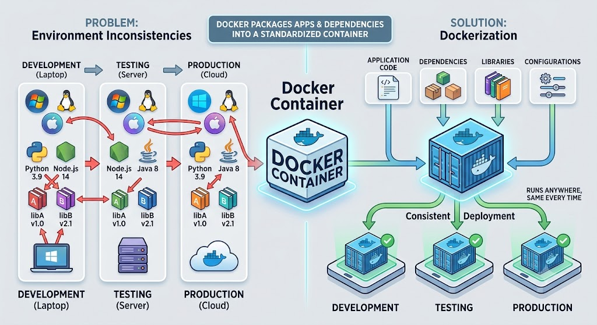
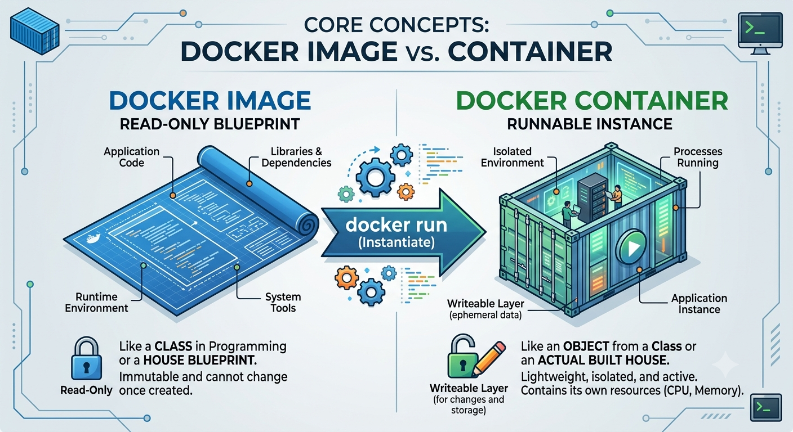
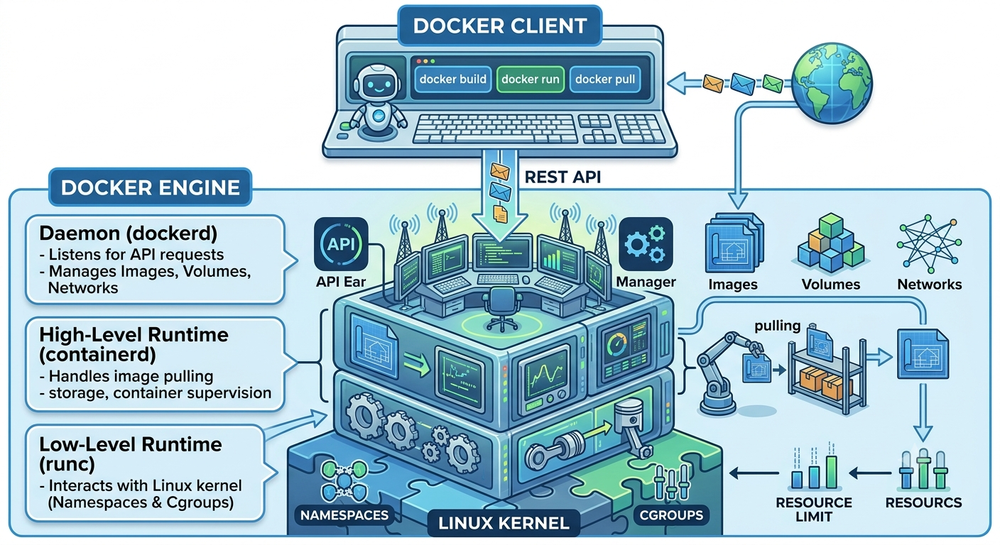
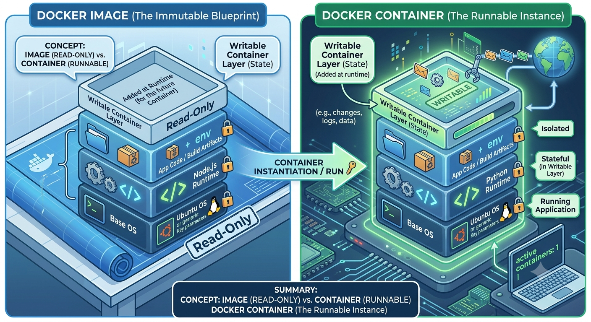

# Docker CLI Tutorial

## Table of Contents

- [Part 1: What is Docker?](#part-1-what-is-docker)
  - [1. The Problem Before Docker](#1-the-problem-before-docker)
  - [2. What Docker Solves](#2-what-docker-solves)
  - [3. Virtual Machines vs. Containers](#3-virtual-machines-vs-containers)
  - [4. Core Concepts: Image vs. Container](#4-core-concepts-image-vs-container)
  - [5. Real-World Use Cases](#5-real-world-use-cases)
  - [6. Install Docker Desktop](#6-install-docker-desktop)
  - [7. Verify Installation](#7-verify-installation)
- [Part 2: Docker Fundamentals](#part-2-docker-fundamentals)
  - [1. Docker Architecture & Docker Engine](#1-docker-architecture--docker-engine)
  - [2. Images vs. Containers](#2-images-vs-containers)
  - [3. Registries & Docker Hub](#3-registries--docker-hub)
  - [4. Persisting Data with Volumes](#4-persisting-data-with-volumes)
  - [5. Docker Networks](#5-docker-networks)
  - [6. Basic Docker Workflow](#6-basic-docker-workflow)
- [Part 3: Your First Container](#part-3-your-first-container)
  - [1. Run Hello World](#1-run-hello-world)
  - [2. Pull an Image Explicitly](#2-pull-an-image-explicitly)
  - [3. Run an Ubuntu Container & Interactive Mode](#3-run-an-ubuntu-container--interactive-mode)
  - [4. Detached Mode (`-d`)](#4-detached-mode--d)
  - [5. Naming Containers (`--name`)](#5-naming-containers---name)
  - [6. Removing Containers](#6-removing-containers)
  - [7. Removing Images](#7-removing-images)
- [Part 4: Essential Docker Commands](#part-4-essential-docker-commands)
  - [1. Inspection & Monitoring Commands](#1-inspection--monitoring-commands)
  - [2. Image Management Commands](#2-image-management-commands)
  - [3. Execution & Lifecycle Commands](#3-execution--lifecycle-commands)
  - [4. Maintenance & Garbage Collection](#4-maintenance--garbage-collection)
- [Part 5: Docker Images](#part-5-docker-images)
  - [1. What is an Image?](#1-what-is-an-image)
  - [2. Image Layers & Caching](#2-image-layers--caching)
  - [3. Image Tags](#3-image-tags)
  - [4. The `latest` Tag (and Why to Avoid It)](#4-the-latest-tag-and-why-to-avoid-it)
  - [5. Pulling Specific Versions](#5-pulling-specific-versions)
  - [6. Image Size Optimization](#6-image-size-optimization)
  - [7. Best Practices Summary](#7-best-practices-summary)
- [Part 6: Dockerfile](#part-6-dockerfile)
  - [1. What is a Dockerfile?](#1-what-is-a-dockerfile)
  - [2. Core Dockerfile Instructions](#2-core-dockerfile-instructions)
  - [3. Putting It Together: Example Dockerfile](#3-putting-it-together-example-dockerfile)
  - [4. Building and Running a Custom Image](#4-building-and-running-a-custom-image)
- [Part 7: Building a Node.js App](#part-7-building-a-nodejs-app)
  - [1. Create Express App](#1-create-express-app)
  - [2. Dockerfile & `.dockerignore`](#2-dockerfile--dockerignore)
  - [3. Build Image](#3-build-image)
  - [4. Run Container](#4-run-container)
  - [5. Test API](#5-test-api)
  - [6. Common Mistakes to Avoid](#6-common-mistakes-to-avoid)
- [Part 8: Docker Volumes](#part-8-docker-volumes)
  - [1. Why Volumes Matter](#1-why-volumes-matter)
  - [2. Bind Mount](#2-bind-mount)
  - [3. Named Volume](#3-named-volume)
  - [4. Anonymous Volume](#4-anonymous-volume)
  - [5. Data Persistence](#5-data-persistence)
  - [6. Backup a Volume](#6-backup-a-volume)
  - [7. Restore a Volume](#7-restore-a-volume)
- [Part 9: Docker Networking](#part-9-docker-networking)
  - [1. Bridge Network](#1-bridge-network)
  - [2. Host Network](#2-host-network)
  - [3. None Network](#3-none-network)
  - [4. Custom Network](#4-custom-network)
  - [5. Connect Multiple Containers](#5-connect-multiple-containers)
  - [6. DNS Inside Docker](#6-dns-inside-docker)
- [Part 10: Docker Compose](#part-10-docker-compose)
  - [1. Why Compose?](#1-why-compose)
  - [2. `docker-compose.yml`](#2-docker-composeyml)
  - [3. Services](#3-services)
  - [4. Networks](#4-networks)
  - [5. Volumes](#5-volumes)
  - [6. Environment Variables](#6-environment-variables)
  - [7. Build Multiple Services](#7-build-multiple-services)
  - [8. Start Everything with One Command](#8-start-everything-with-one-command)
- [Part 11: Multi-Container Project](#part-11-multi-container-project)
  - [1. Project Overview](#1-project-overview)
  - [2. Backend: NestJS + PostgreSQL + Redis](#2-backend-nestjs--postgresql--redis)
  - [3. Frontend: React/Vite](#3-frontend-reactvite)
  - [4. Compose: Wiring It All Together](#4-compose-wiring-it-all-together)
  - [5. Networks](#5-networks)
  - [6. Environment Variables](#6-environment-variables)
  - [7. Dependencies (Startup Order)](#7-dependencies-startup-order)
  - [8. Persistent Data](#8-persistent-data)
  - [9. Run It](#9-run-it)
- [Part 12: Environment Variables](#part-12-environment-variables)
  - [1. `.env` Files](#1-env-files)
  - [2. Passing Variables](#2-passing-variables)
  - [3. Secrets](#3-secrets)
  - [4. Best Practices](#4-best-practices)
  - [5. Different Environments](#5-different-environments)
- [Part 13: Dockerizing Databases](#part-13-dockerizing-databases)
  - [1. PostgreSQL](#1-postgresql)
  - [2. MySQL](#2-mysql)
  - [3. MongoDB](#3-mongodb)
  - [4. Redis](#4-redis)
  - [5. Initializing Databases](#5-initializing-databases)
  - [6. Import/Export Data](#6-importexport-data)
  - [7. Persistent Storage](#7-persistent-storage)
- [Part 14: Docker Logs & Debugging](#part-14-docker-logs--debugging)
  - [1. `docker logs`](#1-docker-logs)
  - [2. `docker exec`](#2-docker-exec)
  - [3. `docker inspect`](#3-docker-inspect)
  - [4. `docker stats`](#4-docker-stats)
  - [5. `docker top`](#5-docker-top)
  - [6. Common Errors](#6-common-errors)
  - [7. Debugging Workflow](#7-debugging-workflow)
- [Part 15: Docker Optimization](#part-15-docker-optimization)
  - [1. Multi-Stage Builds](#1-multi-stage-builds)
  - [2. Alpine Images](#2-alpine-images)
  - [3. Layer Caching](#3-layer-caching)
  - [4. Build Cache](#4-build-cache)
  - [5. Reduce Image Size](#5-reduce-image-size)
  - [6. Security Best Practices](#6-security-best-practices)
- [Part 16: Docker Registry](#part-16-docker-registry)
  - [1. Docker Hub](#1-docker-hub)
  - [2. Login](#2-login)
  - [3. Tag an Image](#3-tag-an-image)
  - [4. Push an Image](#4-push-an-image)
  - [5. Pull an Image](#5-pull-an-image)
  - [6. Private Repositories](#6-private-repositories)
- [Part 17: Deploy with Docker](#part-17-deploy-with-docker)
  - [1. Deploy on a VPS](#1-deploy-on-a-vps)
  - [2. Set Up the Ubuntu Server](#2-set-up-the-ubuntu-server)
  - [3. Pull the Image](#3-pull-the-image)
  - [4. Run the Production Container](#4-run-the-production-container)
  - [5. Nginx Reverse Proxy](#5-nginx-reverse-proxy)
  - [6. HTTPS Overview](#6-https-overview)
- [Part 18: Docker Compose in Production](#part-18-docker-compose-in-production)
  - [1. Production Compose](#1-production-compose)
  - [2. Restart Policy](#2-restart-policy)
  - [3. Health Checks](#3-health-checks)
  - [4. Logging](#4-logging)
  - [5. Environment Management](#5-environment-management)
- [Part 19: Docker Best Practices](#part-19-docker-best-practices)
  - [1. Folder Structure](#1-folder-structure)
  - [2. Naming Convention](#2-naming-convention)
  - [3. Security](#3-security)
  - [4. Non-Root Users](#4-non-root-users)
  - [5. Image Versioning](#5-image-versioning)
  - [6. Resource Limits](#6-resource-limits)
  - [7. Cleanup Strategy](#7-cleanup-strategy)
- [Part 20: Complete Real-World Project](#part-20-complete-real-world-project)
  - [1. Architecture](#1-architecture)
  - [2. Nginx Edge: Single Entry Point](#2-nginx-edge-single-entry-point)
  - [3. SSL/TLS](#3-ssltls)
  - [4. Docker Compose: Layering the Files](#4-docker-compose-layering-the-files)
  - [5. Automatic Restart](#5-automatic-restart)
  - [6. Production-Ready Checklist](#6-production-ready-checklist)
  - [7. Run It](#7-run-it)
- [Bonus Topics](#bonus-topics)
  - [1. Docker Swarm](#1-docker-swarm)
  - [2. Kubernetes Introduction](#2-kubernetes-introduction)
  - [3. Portainer](#3-portainer)
  - [4. Watchtower](#4-watchtower)
  - [5. Traefik](#5-traefik)
  - [6. Docker Secrets](#6-docker-secrets)
  - [7. Docker Buildx](#7-docker-buildx)
  - [8. CI/CD with GitHub Actions or GitLab CI](#8-cicd-with-github-actions-or-gitlab-ci)
  - [9. Monitoring with Prometheus and Grafana](#9-monitoring-with-prometheus-and-grafana)
  - [10. Docker Security Scanning](#10-docker-security-scanning)
  - [11. Backup and Restore Strategies](#11-backup-and-restore-strategies)

---

## Part 1: What is Docker?

### 1. The Problem Before Docker

Before containerization, developers and operations teams frequently ran into the "It works on my machine!" syndrome.

- **Environment Drift**: A project might work perfectly on a developer’s macOS or Windows laptop, but fail on an Ubuntu production server due to differences in OS versions, system libraries, or installed dependencies.

- **Complex Onboarding**: Setting up a new team member's machine meant installing databases, runtimes, and background tools manually—a process prone to human error and time-wasting troubleshooting.

### 2. What Docker Solves



Docker solves environment inconsistencies by packaging an application along with **all of its dependencies, configurations, and libraries** into a standardized unit called a **container**.

- **Portability**: If it runs in a Docker container on your machine, it will run identically on any server, cloud provider, or teammate's machine.

- **Isolation**: Containers run in isolated environments on the host system, ensuring applications don't conflict with one another (e.g., running Node.js v16 and Node.js v20 side-by-side).

### 3. Virtual Machines vs. Containers

| Feature            | Virtual Machines (VMs)              | Docker Containers                          |
| ------------------ | ----------------------------------- | ------------------------------------------ |
| **Architecture**   | Includes full Guest OS + Hypervisor | **Shares Host OS Kernel**                  |
| **Size**           | **Gigabytes (GBs)**                 | **Megabytes (MBs)**                        |
| **Boot Time**      | **Minutes**                         | **Seconds or milliseconds**                |
| **Resource Usage** | Heavy (CPU/RAM hardware allocation) | **Lightweight (uses resources on demand)** |

### 4. Core Concepts: Image vs. Container



- **Docker Image**: A read-only blueprint or template containing application code, libraries, runtime, and environment variables. _(Think of it like a class in programming or a blueprint for a house)_.

- **Docker Container**: A lightweight, runnable instance of an Image. _(Think of it like an object instantiated from a class or the actual built house)_.

### 5. Real-World Use Cases

- **Microservices**: Running multiple independent services (API, frontend, caching, database) isolated from each other.

- **CI/CD Pipelines**: Running automated tests in reproducible, clean environments that spin up and destroy instantly.

- **Local Development**: Running local instances of databases (e.g., PostgreSQL, Redis) without installing them directly onto your operating system.

### 6. Install Docker Desktop

Download and install [Docker Desktop](https://www.docker.com/products/docker-desktop/) for your operating system (Windows, Mac, or Linux).

### 7. Verify Installation

Open your terminal or command prompt and verify the installation:

```bash
# Check Docker CLI version
docker --version

# Verify the Docker Engine is running by starting a test container
docker run hello-world
```

If successful, Docker will download the `hello-world` image from Docker Hub and display a confirmation message indicating your installation is working properly.

## Part 2: Docker Fundamentals

### 1. Docker Architecture & Docker Engine

Docker uses a client-server model. The command-line interface communicates with the background daemon through a REST API over a Unix socket or network interface.



- **Docker CLI (`docker`)**: The terminal tool you interact with to issue commands.

- **Docker Daemon (`dockerd`)**: The primary host service that listens for API requests and manages Docker objects.

- **containerd & runc**: The underlying container runtimes. `containerd` handles image management and lifecycle execution, while `runc` interacts directly with Linux kernel primitives (**Namespaces** for isolation and **Cgroups** for resource limits).

### 2. Images vs. Containers

To understand Docker objects, think of an **Image** as a class definition and a **Container** as an active instance of that class.



- **Images (Read-Only)**: Immutable, layered blueprints consisting of a base OS layer, dependencies, and application code.

- **Containers (Read-Write)**: Ephemeral execution environments. When a container starts, Docker adds a thin **Writable Layer** on top of the image stack using a unified filesystem (like OverlayFS).

### 3. Registries & Docker Hub

A **Docker Registry** is a centralized storage and distribution system for Docker images.

```
          docker push                        docker pull
Developer ------------>  DOCKER REGISTRY   ------------> Production / Teammate
                         (e.g., Docker Hub)
```

- **Docker Hub**: The default public registry hosted by Docker Inc., containing thousands of official, verified base images (e.g., `postgres`, `nginx`, `node`, `redis`).

- **Private Registries**: Enterprise environments often host private registries on AWS ECR, GitHub Container Registry (GHCR), or Azure Container Registry (ACR) to secure proprietary application images.

### 4. Persisting Data with Volumes

By default, data inside a container is ephemeral—if the container is deleted, its writable layer and data disappear. Docker provides **Volumes** and **Bind Mounts** to persist data outside the container lifecycle.

| Storage Type     | Managed By    | Path on Host                         | Primary Use Case                          |
| ---------------- | ------------- | ------------------------------------ | ----------------------------------------- |
| **Named Volume** | Docker Engine | Managed folder inside Docker storage | Databases, persistent state (Recommended) |
| **Bind Mount**   | User          | Anywhere on the host filesystem      | Live development (hot reloading)          |

```bash
# Create and run a Postgres container with a named volume
docker volume create postgres_data

docker run -d \
  --name my-db \
  -v postgres_data:/var/lib/postgresql/data \
  postgres:16
```

### 5. Docker Networks

Containers run isolated from the host network by default. Docker uses network drivers to enable communication between containers and external resources.

- **Bridge (Default)**: Creates a private internal network on the host. Containers on the same bridge network can communicate with each other using container names as hostnames.

- **Host**: Removes network isolation between the container and the Docker host (the container shares the host's network interfaces directly).

- **None**: Disables all networking for complete isolation.

```bash
# Create a custom bridge network
docker network create app-net

# Run containers on the same network so they can communicate
docker run -d --name redis-cache --network app-net redis
docker run -d --name web-api --network app-net -p 8080:8080 my-web-api
```

### 6. Basic Docker Workflow

The day-to-day developer workflow follows three core commands: **Build**, **Run**, and **Manage**.

```
[ Dockerfile ] --( docker build )--> [ Docker Image ] --( docker run )--> [ Active Container ]
```

#### Essential Commands Cheat Sheet

```bash
# 1. Pull an image from Docker Hub
docker pull nginx:alpine

# 2. Run a container in detached mode (-d) with port mapping (-p host:container)
docker run -d --name web-server -p 80:80 nginx:alpine

# 3. List running containers
docker ps

# 4. View container logs
docker logs -f web-server

# 5. Execute an interactive shell inside a running container
docker exec -it web-server sh

# 6. Stop and remove a container
docker stop web-server
docker rm web-server
```

## Part 3: Your First Container

Now that we understand Docker's architecture and core concepts, it's time to get hands-on with CLI commands. In this section, you'll run your first containers, learn execution modes, and manage system resources.

### 1. Run Hello World

The classic entry point to verify your Docker installation and understand the default pull-and-run behavior:

```bash
docker run hello-world
```

#### What happens under the hood?

- Docker checks if the `hello-world` image exists locally.

- If not found, it automatically pulls the image from Docker Hub.

- It creates a new container, executes the script inside, prints the output to your terminal, and then exits.

### 2. Pull an Image Explicitly

While `docker run` automatically pulls missing images, you can pre-fetch images using `docker pull`. This is useful when preparing deployment scripts or caching images ahead of time.

```bash
# Pull the official NGINX image without running it
docker pull nginx:alpine

# List locally downloaded images
docker images
```

### 3. Run an Ubuntu Container & Interactive Mode

By default, containers exit immediately if they don't have an active background process. To interact with an operating system container like Ubuntu, you must attach an interactive terminal session.

```bash
# Run Ubuntu with Interactive (-i) and TTY (-t) flags
docker run -it ubuntu bash
```

- `-i` (Interactive): Keeps `STDIN` open so you can pass input commands.

- `-t` (TTY): Allocates a pseudo-terminal, giving you a proper command prompt.

Once inside, you are running commands inside the isolated Ubuntu container:

```bash
# Example commands inside the container
root@a1b2c3d4e5f6:/# cat /etc/os-release
root@a1b2c3d4e5f6:/# exit
```

### 4. Detached Mode (`-d`)

For long-running services (like web servers or databases), you don't want the container attached to your current terminal session. **Detached mode** runs the container in the background.

```bash
# Run NGINX in detached mode
docker run -d nginx

# Check running containers
docker ps
```

To view what's happening inside a detached container:

```bash
# View container logs (use -f to stream/follow logs)
docker logs -f <CONTAINER_ID>
```

### 5. Naming Containers (`--name`)

By default, Docker assigns random generated names (e.g., `focused_curie`, `eager_hopper`). Assigning explicit names makes managing containers significantly easier in scripts and CLI commands.

```bash
# Run a named NGINX container
docker run -d --name my-web-server -p 8080:80 nginx

# Stop and check status using the custom name
docker stop my-web-server
```

### 6. Removing Containers

When a container stops, it is not deleted automatically; it remains on disk in a stopped state.

```bash
# List all containers (including stopped ones)
docker ps -a

# Remove a specific stopped container
docker rm my-web-server

# Force remove a currently running container (-f)
docker rm -f my-web-server

# Clean up all stopped containers at once
docker container prune
```

**Tip**: You can use the `--rm` flag with `docker run` to automatically remove a container as soon as it exits (great for temporary tasks or scripts):

```bash
docker run --rm ubuntu echo "Temporary task completed!"
```

### 7. Removing Images

To free up disk space on your host machine, you can clean up unused base images.

```bash
# List all local images
docker images

# Remove an image by ID or Tag (must remove dependent containers first)
docker rmi nginx:latest

# Remove all unused/dangling images
docker image prune -a
```

### Summary Cheat Sheet

| Task                       | Command                               |
| -------------------------- | ------------------------------------- |
| **Pull image**             | `docker pull <image>`                 |
| **Run interactively**      | `docker run -it <image> bash`         |
| **Run in background**      | `docker run -d --name <name> <image>` |
| **View active containers** | `docker ps`                           |
| **View all containers**    | `docker ps -a`                        |
| **Stop container**         | `docker stop <name_or_id>`            |
| **Delete container**       | `docker rm <name_or_id>`              |
| **Delete image**           | `docker rmi <image_or_id>`            |

## Part 4: Essential Docker Commands

Mastering Docker comes down to understanding a core set of CLI commands. This reference guide breaks down the essential commands every developer needs for inspecting, executing, managing, and maintaining Docker containers and system resources.

### 1. Inspection & Monitoring Commands

- `docker ps`
  Lists active and running containers on your system.

  ```bash
  # List only currently running containers
  docker ps

  # List all containers (running, stopped, and exited)
  docker ps -a

  # Show only container IDs (useful for scripts/automation)
  docker ps -q
  ```

- `docker images`
  Lists all Docker images stored locally on your machine.

  ```bash
  # View all local images with tags and sizes
  docker images
  ```

- `docker logs`
  Fetches stdout/stderr logs from a specific container. Critical for debugging background processes.

  ```bash
  # Fetch current logs
  docker logs <container_name_or_id>

  # Stream/follow logs in real-time
  docker logs -f <container_name_or_id>

  # View the last 50 log entries
  docker logs --tail 50 <container_name_or_id>
  ```

- `docker inspect`
  Returns detailed low-level internal configurations and metadata (IP address, volume mounts, network settings, environment variables) in JSON format.

  ```bash
  # Inspect complete container configuration
  docker inspect <container_name_or_id>

  # Extract specific metadata using formatting (e.g., retrieve IP address)
  docker inspect -f '{{range .NetworkSettings.Networks}}{{.IPAddress}}{{end}}' <container_name>
  ```

### 2. Image Management Commands

- `docker pull`
  Downloads a Docker image from a remote registry (like Docker Hub) without instantiating a container.

  ```bash
  # Pull a specific image tag
  docker pull postgres:16-alpine
  ```

- `docker rmi`
  Removes one or more local Docker images from your system.

  ```bash
  # Remove an image by tag or ID
  docker rmi postgres:16-alpine

  # Force removal of an image in use by a stopped container
  docker rmi -f <image_id>
  ```

### 3. Execution & Lifecycle Commands

- `docker run`
  Creates and starts a new container from an image. Combines `docker create` and `docker start`.

  ```bash
  # Common pattern: run detached (-d), named (--name), with port mapping (-p host:container)
  docker run -d --name my-redis -p 6379:6379 redis:alpine
  ```

- `docker exec`
  Executes a new command inside an already running container.

  ```bash
  # Open an interactive shell inside a running container
  docker exec -it my-redis sh

  # Run a single non-interactive command inside a container
  docker exec my-redis redis-cli ping
  ```

- `docker stop`
  Gracefully stops a running container by sending a `SIGTERM` signal, followed by `SIGKILL` if it doesn't stop within the timeout period.

  ```bash
  # Stop a running container
  docker stop <container_name_or_id>
  ```

- `docker start`
  Starts one or more stopped containers without re-creating them.

  ```bash
  # Restart a previously stopped container
  docker start <container_name_or_id>
  ```

- `docker restart`
  Stops and immediately restarts a running or stopped container.

  ```bash
  # Restart a container
  docker restart <container_name_or_id>
  ```

- `docker rm`
  Removes stopped containers from disk.

  ```bash
  # Remove a stopped container
  docker rm <container_name_or_id>

  # Force remove a currently running container (-f)
  docker rm -f <container_name_or_id>
  ```

### 4. Maintenance & Garbage Collection

- `docker system prune`
  Frees up disk space by removing all stopped containers, unused networks, dangling images, and build caches in one command.

  ```bash
  # Clean up unused Docker resources
  docker system prune

  # Comprehensive deep clean (removes all unused images and persistent volumes)
  docker system prune -a --volumes
  ```

### Command Summary Quick Reference

| Command               | Purpose                              |
| --------------------- | ------------------------------------ |
| `docker ps`           | List containers                      |
| `docker images`       | List local images                    |
| `docker pull`         | Fetch an image from registry         |
| `docker run`          | Create and start a container         |
| `docker exec`         | Execute command in running container |
| `docker logs`         | Print container logs                 |
| `docker inspect`      | Output low-level JSON details        |
| `docker stop`         | Gracefully stop container            |
| `docker start`        | Start stopped container              |
| `docker restart`      | Stop and restart container           |
| `docker rm`           | Delete stopped container             |
| `docker rmi`          | Delete local image                   |
| `docker system prune` | Remove unused/dangling resources     |

## Part 5: Docker Images

Understanding Docker Images is fundamental to packaging applications efficiently. In this section, we'll dive deep into what images actually are under the hood, how layer caching works, how to manage image tagging effectively, and strategies for keeping image sizes small.

### 1. What is an Image?

A **Docker Image** is a lightweight, standalone, executable package that includes everything needed to run a piece of software: application code, runtime, system tools, libraries, and settings.

Images are **immutable** (read-only) templates used to instantiate Docker containers. When a container runs, Docker adds a thin writable layer on top of the image layers.

### 2. Image Layers & Caching

Docker images are composed of stacked, read-only layers. Each instruction in a `Dockerfile` (e.g., `FROM`, `RUN`, `COPY`) creates a new layer.

```
+-------------------------------------------------------+
|  Writable Container Layer                             | <-- Added when container starts
+-------------------------------------------------------+
|  Layer 4: CMD ["node", "server.js"]                   |
|  Layer 3: COPY . .                                    |
|  Layer 2: RUN npm install                             |
|  Layer 1: FROM node:20-alpine                         |
+-------------------------------------------------------+
```

#### Layer Caching

Docker reuses layers from previous builds if the instructions and files haven't changed.

- **Cache Hits:** Unchanged steps are reused instantly, making builds fast.

- **Cache Invalidation:** If a layer changes (e.g., updated source code in `COPY`), that layer and all subsequent layers are rebuilt from scratch.

### 3. Image Tags

Tags act as aliases or pointers to specific image versions. The full reference for an image follows this naming structure:

```
[registry_url]/[repository]/[image_name]:[tag]
```

Examples:

- `postgres:16-alpine` (Official image from Docker Hub with specific version and OS variant)
- `ghcr.io/my-org/my-app:v1.2.0` (Image stored on GitHub Container Registry)

### 4. The `latest` Tag (and Why to Avoid It)

If you pull or build an image without specifying a tag (e.g., `docker pull node`), Docker automatically appends `:latest`.

> **Warning:** The `:latest` tag does not mean "the guaranteed newest release." It is simply a default label applied by image maintainers. Using `:latest` in production can lead to unexpected breakages because the underlying image version can change without notice.

### 5. Pulling Specific Versions

Always pin explicit version tags to ensure consistent, reproducible environments across development, testing, and production.

```bash
# Bad practice (unpredictable behavior over time)
docker pull postgres

# Good practice (explicit major version and minimal base OS)
docker pull postgres:16-alpine
```

### 6. Image Size Optimization

Large images take longer to download, consume unnecessary disk space, and increase the attack surface for security vulnerabilities.

#### Key Optimization Strategies:

1. **Use Minimal Base Images**: Choose minimal distributions like **Alpine Linux** (`alpine`) or slim images (`node:20-slim`) instead of full Linux distributions (`ubuntu`).

2. **Combine `RUN` Commands**: Combine shell commands into a single `RUN` instruction to minimize the total layer count.

3. **Utilize `.dockerignore`**: Exclude non-essential files (e.g., `.git`, `node_modules`, build logs) from the build context.

4. **Leverage Multi-Stage Builds**: Build dependencies in a temporary stage and copy only compiled artifacts into a lightweight final runtime image.

### 7. Best Practices Summary

- **Pin Specific Version Tags**: Never rely on `:latest` in production deployment scripts.

- **Order Dockerfile Instructions Wisely**: Place infrequently changed instructions (like dependency installations) before frequently changing instructions (like application source code copy) to maximize build caching.

- **Keep Images Minimal**: Exclude build tools, documentation, and source code from final production images.

- **Scan Images for Vulnerabilities**: Periodically audit images using security scanners like `docker scout` or `trivy`.

## Part 6: Dockerfile

A **Dockerfile** is the foundational building block for creating custom Docker images. In this section, we'll break down what a Dockerfile is, explore essential instructions, contrast similar commands (like `COPY` vs `ADD` and `CMD` vs `ENTRYPOINT`), and demonstrate how to build and run custom images.

### 1. What is a Dockerfile?

A **Dockerfile** is a text document containing a sequential list of instructions that Docker executes to assemble a custom image. It automates the entire image creation process, ensuring builds are reproducible and version-controlled.

### 2. Core Dockerfile Instructions

- `FROM`
  Sets the base image for subsequent instructions. Every valid Dockerfile must start with a `FROM` instruction.

  ```dockerfile
  FROM node:20-alpine
  ```

- `WORKDIR`
  Sets the working directory inside the container for any subsequent `RUN`, `CMD`, `ENTRYPOINT`, `COPY`, or `ADD` instructions. If the directory doesn't exist, Docker creates it automatically.

  ```dockerfile
  WORKDIR /app
  ```

- `COPY` vs `ADD`
  Both instructions transfer files from the `host machine` into the `container image`, but they have distinct differences:
  - `COPY`: Copies local files and directories from the `build context` into the image. **(Recommended for almost all use cases)**.

  - `ADD`: Includes extra features like auto-extracting local tar archives (`.tar.gz`) and fetching files directly from remote URLs.

  ```dockerfile
  # Standard file copy (Best Practice)
  COPY package.json package-lock.json ./

  # Auto-extracting a local tar archive
  ADD archive.tar.gz /extracted-files/
  ```

- `RUN`
  Executes commands during the build phase to install packages, create files, or set up dependencies. Each `RUN` instruction creates a new read-only image layer.

  ```dockerfile
  # Chain commands with && to reduce image layer count
  RUN apt-get update && apt-get install -y \
      curl \
      git \
      && rm -rf /var/lib/apt/lists/*
  ```

- `ENV` vs `ARG`
  Both define variables during the image lifecycle, but they operate at different stages:

  | Instruction | Scope           | Persistence              | Example Use Case                       |
  | ----------- | --------------- | ------------------------ | -------------------------------------- |
  | `ARG`       | Build time only | Not available in running | Passing version tags, build flags      |
  | `ENV`       | Build time &    | Persists inside running  | Database host, application environment |

  ```dockerfile
  # Available only during 'docker build'
  ARG BUILD_VERSION=1.0.0

  # Persists in the container at runtime
  ENV NODE_ENV=production
  ENV PORT=3000
  ```

- `EXPOSE`
  Informs Docker that the container listens on specific network ports at runtime. **Note**: `EXPOSE` acts as documentation between the image creator and user—it does not actually publish the port on the host.

  ```dockerfile
  EXPOSE 3000
  ```

- `CMD` vs `ENTRYPOINT`
  Both specify the command executed when a container starts, but they behave differently when overridden:
  - `CMD`: Sets default arguments or commands that can be **easily overridden** from the command line.
  - `ENTRYPOINT`: Configures a container to run as an executable. Command-line arguments passed to `docker run` are appended to `ENTRYPOINT` rather than replacing it.

  ```dockerfile
  # CMD example: easily overridden by passing a command to 'docker run'
  CMD ["node", "server.js"]

  # ENTRYPOINT + CMD pattern: ENTRYPOINT sets fixed executable, CMD sets default argument
  ENTRYPOINT ["node"]
  CMD ["server.js"]
  ```

### 3. Putting It Together: Example Dockerfile

Here is a complete, production-ready Dockerfile for a Node.js application:

```dockerfile
# 1. Base image
FROM node:20-alpine

# 2. Build-time argument and runtime environment
ARG BUILD_DATE
LABEL org.opencontainers.image.created=$BUILD_DATE
ENV NODE_ENV=production

# 3. Set working directory
WORKDIR /app

# 4. Copy dependency definitions first (for layer caching)
COPY package*.json ./

# 5. Install dependencies
RUN npm ci --only=production

# 6. Copy application code
COPY . .

# 7. Document exposed port
EXPOSE 3000

# 8. Set default runtime command
CMD ["npm", "start"]
```

### 4. Building and Running a Custom Image

#### Build the Image (`docker build`)

Use `docker build` with the `-t` (tag) flag to name your image, pointing to the build context directory (usually `.`):

```bash
# Build image tagged 'my-app:v1' using current directory context
docker build -t my-app:v1 .

# Build passing a build argument
docker build --build-arg BUILD_DATE=$(date -u +'%Y-%m-%dT%H:%M:%SZ') -t my-app:v1 .
```

#### Run the Custom Container (`docker run`)

Instantiate a container from your newly built custom image:

```bash
# Run detached, map host port 8080 to container port 3000
docker run -d --name my-running-app -p 8080:3000 my-app:v1
```

## Part 7: Building a Node.js App

Now that we understand Dockerfiles and core image commands, let's put theory into practice by containerizing a lightweight Node.js Express application from scratch.

### 1. Create Express App

Start by initializing a basic Express web application.

Create `package.json`:

```json
{
  "name": "docker-node-express",
  "version": "1.0.0",
  "description": "Express app containerized with Docker",
  "main": "index.js",
  "scripts": {
    "start": "node index.js"
  },
  "dependencies": {
    "express": "^4.19.2"
  }
}
```

Create `index.js`:

```javascript
const express = require("express");
const app = express();
const PORT = process.env.PORT || 3000;

app.get("/", (req, res) => {
  res.json({
    status: "success",
    message: "Hello from inside the Docker container!",
    timestamp: new Date().toISOString(),
  });
});

app.get("/health", (req, res) => {
  res.status(200).json({ status: "UP" });
});

app.listen(PORT, "0.0.0.0", () => {
  console.log(`Server running on http://0.0.0.0:${PORT}`);
});
```

### 2. Dockerfile & `.dockerignore`

Create a `.dockerignore` file in the project root to prevent copying local node modules and build artifacts into the build context:

Create `.dockerignore`:

```
node_modules
npm-debug.log
.git
.gitignore
README.md
```

Create `Dockerfile`:

```dockerfile
# 1. Use lightweight LTS base image
FROM node:20-alpine

# 2. Build-time argument and runtime environment
ARG BUILD_DATE
LABEL org.opencontainers.image.created=$BUILD_DATE
ENV NODE_ENV=production

# 3. Set working directory
WORKDIR /app

# 4. Copy package definitions first to utilize layer caching
COPY package*.json ./

# 5. Install production dependencies
RUN npm ci --only=production

# 6. Copy remaining application code
COPY . .

# 7. Expose port 3000
EXPOSE 3000

# 8. Define entry point command
CMD ["npm", "start"]
```

### 3. Build Image

Build your Docker image and tag it as `express-app:v1`:

```bash
docker build -t express-app:v1 .
```

To verify the image was created:

```bash
docker images express-app:v1
```

### 4. Run Container

Run the newly built container in detached mode (`-d`), mapping port `3000` on your host to port `3000` inside the container:

```bash
docker run -d \
  --name my-express-container \
  -p 3000:3000 \
  express-app:v1
```

Verify it is running:

```bash
docker ps -f name=my-express-container
```

### 5. Test API

You can test the containerized endpoint using `curl` or your browser:

```bash
# Test primary endpoint
curl http://localhost:3000

# Expected Response:
# {"status":"success","message":"Hello from inside the Docker container!","timestamp":"..."}

# Test health check endpoint
curl http://localhost:3000/health

# Expected Response:
# {"status":"UP"}
```

### 6. Common Mistakes to Avoid

- **Binding Express to `127.0.0.1` (localhost) instead of `0.0.0.0`**: Inside a container, `localhost` refers only to the container's internal loopback interface. If Express listens on `127.0.0.1`, external traffic forwarded by Docker won't reach it. Always bind to `0.0.0.0`.

- **Forgetting `.dockerignore`**: Omitting `.dockerignore` causes your local `node_modules/` folder to overwrite container dependencies, which can lead to platform mismatch bugs (e.g., native binaries compiled on macOS failing on Linux Alpine).

- **Copying code before running `npm install`**: Copying `COPY . .` before `RUN npm install` invalidates the layer cache on every single code edit, forcing `npm install` to re-run on every build.

- **Running as root user**: By default, Docker containers run as `root`. For production environments, switch to a non-root user (e.g., adding `USER node` before `CMD` in your Dockerfile) to improve security.

## Part 8: Docker Volumes

Containers are designed to be ephemeral—when a container is removed, any data written to its writable layer disappears with it. This section covers Docker's storage mechanisms for persisting data beyond a container's lifecycle, and how to back it up and restore it.

### 1. Why Volumes Matter

By default, all files created inside a container are stored in that container's thin writable layer:

- **Data is lost on removal**: If you `docker rm` a container, its writable layer—and any data in it—is deleted permanently.

- **Data can't be easily shared**: Files inside a container's writable layer aren't accessible to other containers or the host without extra tooling.

- **Performance overhead**: Writing large amounts of data into the writable layer is less efficient than writing to a Volume, which bypasses the storage driver entirely.

Docker solves these problems with three storage mechanisms: **Bind Mounts**, **Named Volumes**, and **Anonymous Volumes**.

### 2. Bind Mount

A **Bind Mount** maps a specific file or directory on the **host machine** directly into the container. The host is fully responsible for managing the path—Docker just links to it.

```bash
# Mount the current host directory (./app) into /app inside the container
docker run -d \
  --name dev-container \
  -v $(pwd)/app:/app \
  node:20-alpine

# Equivalent using the more explicit --mount syntax
docker run -d \
  --name dev-container \
  --mount type=bind,source=$(pwd)/app,target=/app \
  node:20-alpine
```

- **Best for**: Local development, where you want source code changes on your host to instantly reflect inside a running container (hot reloading).

- **Caveat**: The host path must already exist and is tightly coupled to your local machine's file structure, which makes Bind Mounts less portable across environments.

### 3. Named Volume

A **Named Volume** is storage that Docker creates and fully manages inside its own storage area on the host (typically under `/var/lib/docker/volumes/` on Linux). You reference it by name rather than a host path.

```bash
# Create a named volume explicitly
docker volume create postgres_data

# Run a container using the named volume
docker run -d \
  --name my-db \
  -v postgres_data:/var/lib/postgresql/data \
  postgres:16-alpine

# List all volumes
docker volume ls

# Inspect a volume (shows its actual location on the host)
docker volume inspect postgres_data
```

- **Best for**: Databases and any persistent application state (recommended over Bind Mounts for production).

- **Advantage**: Docker manages the lifecycle and location, making Named Volumes portable across hosts and easy to back up, migrate, or share between containers.

### 4. Anonymous Volume

An **Anonymous Volume** is created automatically when a container specifies a mount path without naming a source. Docker assigns it a random hash as an identifier instead of a human-readable name.

```bash
# No source specified before the colon -> Docker creates an anonymous volume
docker run -d --name my-app -v /app/data node:20-alpine
```

- **Behavior**: Functions identically to a Named Volume, but because it has no memorable name, it's easy to lose track of.

- **Caveat**: Anonymous Volumes are **not** removed automatically when their container is removed (unless you use `docker rm -v`), which commonly leads to orphaned volumes cluttering disk space. Prefer Named Volumes when data needs to persist and be found again later.

### 5. Data Persistence

Because Named Volumes exist independently of any single container, the same volume can be reattached to a brand-new container after the original is deleted—the data survives.

```bash
# Run a container, write data, then remove the container (data persists in the volume)
docker run -d --name db-v1 -v postgres_data:/var/lib/postgresql/data postgres:16-alpine
docker rm -f db-v1

# Attach the SAME volume to a fresh container—the data is still there
docker run -d --name db-v2 -v postgres_data:/var/lib/postgresql/data postgres:16-alpine
```

This decouples your data's lifecycle from any individual container's lifecycle, which is essential for safely recreating containers during updates or redeployments.

### 6. Backup a Volume

To back up a Named Volume, run a temporary container that mounts the volume alongside a host directory, then archive the volume's contents into a `.tar.gz` file on the host.

```bash
# Back up the "postgres_data" volume into a tarball on the host's current directory
docker run --rm \
  -v postgres_data:/volume-data \
  -v $(pwd):/backup \
  alpine \
  tar czf /backup/postgres_data_backup.tar.gz -C /volume-data .
```

- `-v postgres_data:/volume-data`: Mounts the volume you want to back up (read-only in spirit, though not enforced here).

- `-v $(pwd):/backup`: Mounts the current host directory so the backup file lands where you can access it.

- `--rm`: Automatically removes the temporary helper container once the backup completes.

### 7. Restore a Volume

To restore, create (or reuse) a target volume, then extract the backup tarball back into it using the same temporary-container pattern.

```bash
# Ensure the target volume exists
docker volume create postgres_data_restored

# Extract the backup archive into the volume
docker run --rm \
  -v postgres_data_restored:/volume-data \
  -v $(pwd):/backup \
  alpine \
  tar xzf /backup/postgres_data_backup.tar.gz -C /volume-data

# Attach the restored volume to a new container to verify
docker run -d \
  --name db-restored \
  -v postgres_data_restored:/var/lib/postgresql/data \
  postgres:16-alpine
```

### Summary Cheat Sheet

| Task                       | Command                                            |
| -------------------------- | --------------------------------------------------- |
| **Create named volume**    | `docker volume create <name>`                      |
| **List volumes**           | `docker volume ls`                                 |
| **Inspect volume**         | `docker volume inspect <name>`                     |
| **Remove volume**          | `docker volume rm <name>`                          |
| **Remove unused volumes**  | `docker volume prune`                              |
| **Bind mount**             | `docker run -v <host_path>:<container_path> ...`   |
| **Named volume mount**     | `docker run -v <volume_name>:<container_path> ...` |
| **Anonymous volume**       | `docker run -v <container_path> ...`               |

## Part 9: Docker Networking

By default, containers are isolated from the host and from each other. Docker Networking controls how containers communicate—with the outside world, with the host, and with one another. This section covers the built-in network drivers, how to create your own network, and how containers find each other by name.

### 1. Bridge Network

**Bridge** is Docker's default network driver. When the Docker daemon starts, it creates a virtual bridge (`docker0` on Linux) on the host, and every container that doesn't specify a network is attached to it.

```bash
# List existing networks (note the default "bridge" network)
docker network list

# Run a container without specifying --network -> it joins the default bridge
docker run -d --name web nginx:alpine

# Inspect the default bridge network to see attached containers and subnet
docker network inspect bridge
```

- **Isolation**: Containers on the default bridge network can reach each other and the outside world, but are not reachable from the host or other networks unless ports are published with `-p`.

- **Caveat**: Containers on the **default** bridge network can only reach each other by IP address—not by container name. Use a **Custom Network** (below) if you need name-based DNS resolution.

### 2. Host Network

The **Host** network driver removes network isolation between the container and the Docker host entirely—the container shares the host's network stack directly.

```bash
# Run NGINX using the host's network directly (Linux only)
docker run -d --name web --network host nginx:alpine

# No -p flag is needed or possible: the container binds directly to the host's ports
curl http://localhost:80
```

- **Best for**: Performance-sensitive workloads that want to avoid Docker's network address translation (NAT) overhead.

- **Caveat**: Port mapping (`-p`) has no effect and is unnecessary since there's no network isolation to bridge—the container's ports **are** the host's ports, so port conflicts with other services on the host are possible. Not supported on Docker Desktop for Mac/Windows in the same way as on Linux.

### 3. None Network

The **None** driver disables networking entirely. The container gets its own network namespace but no network interfaces are configured beyond a loopback.

```bash
# Run a container with no network access at all
docker run -d --name isolated-task --network none alpine sleep 3600
```

- **Best for**: Running fully isolated batch jobs or security-sensitive tasks that should have zero network access.

### 4. Custom Network

Creating your own **bridge** network is the recommended approach for multi-container applications, because Docker provides automatic DNS resolution by container name on any user-defined network (unlike the default bridge).

```bash
# Create a custom bridge network
docker network create app-net

# Inspect it
docker network inspect app-net

# Run containers attached to the custom network
docker run -d --name redis-cache --network app-net redis:alpine
docker run -d --name web-api --network app-net -p 8080:8080 my-web-api

# Remove a network (must have no containers attached)
docker network rm app-net

# Remove all unused networks
docker network prune
```

### 5. Connect Multiple Containers

Multiple containers can share a network to communicate, and an already-running container can be attached to additional networks after the fact.

```bash
# Attach an already-running container to another network
docker network connect app-net web-api

# Detach a container from a network
docker network disconnect app-net web-api

# Run a Postgres database and an API on the same custom network
docker network create backend-net
docker run -d --name db --network backend-net -e POSTGRES_PASSWORD=secret postgres:16-alpine
docker run -d --name api --network backend-net -p 3000:3000 -e DB_HOST=db my-api
```

Inside the `api` container, the application can connect to the database using the hostname `db`—Docker resolves it to the container's internal IP automatically.

### 6. DNS Inside Docker

On any user-defined (custom) network, Docker runs an embedded DNS server that resolves container names to their internal IP addresses—no manual `/etc/hosts` editing required.

```bash
# From inside "web-api" (on app-net), ping "redis-cache" by name
docker exec -it web-api ping redis-cache

# Look up the resolved IP for a container name
docker exec -it web-api getent hosts redis-cache
```

- **Name resolution scope**: Only containers on the **same custom network** can resolve each other by name. Containers on the default bridge network cannot.

- **`--network-alias`**: Assigns additional DNS names to a container on a given network, useful for giving a service multiple aliases (e.g., `db` and `primary-db`).

  ```bash
  docker run -d --name postgres-1 --network backend-net --network-alias db postgres:16-alpine
  ```

### Summary Cheat Sheet

| Task                          | Command                                              |
| ------------------------------ | ----------------------------------------------------- |
| **List networks**              | `docker network ls`                                  |
| **Create custom network**      | `docker network create <name>`                       |
| **Inspect network**            | `docker network inspect <name>`                      |
| **Remove network**             | `docker network rm <name>`                           |
| **Remove unused networks**     | `docker network prune`                               |
| **Run on custom network**      | `docker run --network <name> ...`                    |
| **Connect running container**  | `docker network connect <network> <container>`       |
| **Disconnect container**       | `docker network disconnect <network> <container>`    |
| **Run with no networking**     | `docker run --network none ...`                      |
| **Run with host networking**   | `docker run --network host ...`                      |

## Part 10: Docker Compose

Real applications rarely run as a single container—they're made up of a web server, an API, a database, a cache, and more. Manually running each with `docker run` and wiring up networks and volumes by hand doesn't scale. **Docker Compose** solves this by letting you define a whole multi-container application declaratively in one file.

### 1. Why Compose?

Compose replaces long sequences of `docker network create`, `docker volume create`, and `docker run` commands with a single declarative YAML file and a single command.

- **Declarative**: The entire application stack (services, networks, volumes, environment variables) is described in one version-controlled file instead of scattered shell commands.

- **Reproducible**: Anyone on the team can spin up the exact same multi-container environment with one command.

- **Automatic networking**: Compose creates a dedicated network for your project by default, and every service can reach every other service by its service name (same DNS resolution as a custom network from [Part 9](#part-9-docker-networking)).

### 2. `docker-compose.yml`

A Compose file is a YAML document, conventionally named `docker-compose.yml`, placed at the root of your project. It defines `services`, and optionally `networks` and `volumes`.

```yaml
# docker-compose.yml
services:
  web:
    image: nginx:alpine
    ports:
      - "8080:80"
```

```bash
# Start the stack defined in docker-compose.yml (in the current directory)
docker compose up

# Stop and remove containers, networks created by "up"
docker compose down
```

> **Note**: Modern Docker ships Compose as a CLI plugin (`docker compose`, no hyphen). The older standalone `docker-compose` binary still works the same way but is being phased out.

### 3. Services

Each entry under `services` describes one container—its image (or build instructions), ports, dependencies, and configuration. `depends_on` controls startup order between services.

```yaml
services:
  api:
    image: my-api:v1
    ports:
      - "3000:3000"
    depends_on:
      - db

  db:
    image: postgres:16-alpine
    environment:
      POSTGRES_PASSWORD: secret
```

- **`depends_on`** controls **start order** only—it does not wait for the database to be ready to accept connections. For true readiness checks, pair it with a `healthcheck` (covered in [Part 18: Docker Compose in Production](#part-18-docker-compose-in-production)).

### 4. Networks

By default, Compose creates a single project-scoped bridge network and attaches every service to it automatically—no manual `docker network create` needed. Services reach each other using their service name as the hostname.

```yaml
services:
  api:
    image: my-api:v1
    networks:
      - backend

  db:
    image: postgres:16-alpine
    networks:
      - backend

networks:
  backend:
    driver: bridge
```

Inside the `api` container, connecting to `db:5432` resolves automatically to the database container's internal IP.

### 5. Volumes

Named volumes can be declared once at the top level under `volumes` and then referenced by any service, giving you the same data-persistence benefits covered in [Part 8](#part-8-docker-volumes).

```yaml
services:
  db:
    image: postgres:16-alpine
    volumes:
      - postgres_data:/var/lib/postgresql/data

volumes:
  postgres_data:
```

```bash
# List volumes created by Compose (prefixed with the project name)
docker volume ls
```

### 6. Environment Variables

Services can receive configuration through `environment` (inline key/value pairs) or `env_file` (load from a `.env`-style file), keeping secrets and per-environment config out of the image itself.

```yaml
services:
  api:
    image: my-api:v1
    environment:
      NODE_ENV: production
      DB_HOST: db
    env_file:
      - .env
```

Compose also automatically reads a `.env` file in the project root to substitute `${VARIABLE}` placeholders directly inside `docker-compose.yml` itself:

```yaml
services:
  db:
    image: postgres:16-alpine
    environment:
      POSTGRES_PASSWORD: ${DB_PASSWORD}
```

(Full coverage of `.env` files and secrets management is in [Part 12: Environment Variables](#part-12-environment-variables).)

### 7. Build Multiple Services

Instead of `image`, a service can use `build` to build a custom image from a local `Dockerfile`—Compose builds each service's image and wires them together in one step.

```yaml
services:
  frontend:
    build:
      context: ./frontend
      dockerfile: Dockerfile
    ports:
      - "5173:5173"

  api:
    build: ./api
    ports:
      - "3000:3000"
    depends_on:
      - db

  db:
    image: postgres:16-alpine
    volumes:
      - postgres_data:/var/lib/postgresql/data

volumes:
  postgres_data:
```

```bash
# Build (or rebuild) images for all services that define "build"
docker compose build

# Force a rebuild without using the layer cache
docker compose build --no-cache
```

### 8. Start Everything with One Command

`docker compose up` builds (if needed), creates the network and volumes, and starts every service in dependency order—all from one command.

```bash
# Build images and start all services in the foreground
docker compose up --build

# Start all services in detached mode
docker compose up -d

# View aggregated logs from all services
docker compose logs -f

# List running services for this project
docker compose ps

# Stop all services without removing containers/networks
docker compose stop

# Stop and remove containers, networks (add -v to also remove volumes)
docker compose down -v
```

### Summary Cheat Sheet

| Task                              | Command                              |
| ---------------------------------- | ------------------------------------- |
| **Start stack (foreground)**       | `docker compose up`                  |
| **Start stack (detached)**         | `docker compose up -d`               |
| **Build images**                   | `docker compose build`               |
| **Build and start**                | `docker compose up --build`          |
| **List running services**          | `docker compose ps`                  |
| **View logs**                      | `docker compose logs -f`             |
| **Stop services**                  | `docker compose stop`                |
| **Stop and remove everything**     | `docker compose down`                |
| **Stop and remove incl. volumes**  | `docker compose down -v`             |

## Part 11: Multi-Container Project

Time to combine everything from Parts 8–10 into a real multi-container application. The full project lives in [`multi-container-project/`](./multi-container-project) and is composed of four services: a **React/Vite** frontend, a **NestJS** backend, a **PostgreSQL** database, and a **Redis** cache—all orchestrated with a single `docker-compose.yml`.

### 1. Project Overview

```
multi-container-project/
├── docker-compose.yml
├── .env.example
├── frontend/          # React (Vite) - talks to the backend API
│   ├── Dockerfile
│   ├── package.json
│   └── src/
└── backend/            # NestJS - exposes /health, /db-check, /cache-check
    ├── Dockerfile
    ├── package.json
    └── src/
```

- **Frontend** fetches `/health` from the backend on load and renders the response.
- **Backend** exposes three endpoints: `/health` (liveness), `/db-check` (round-trips a query to PostgreSQL), and `/cache-check` (reads/writes a key in Redis).
- **PostgreSQL** and **Redis** run as their own services using official images—no custom Dockerfile needed for either.

### 2. Backend: NestJS + PostgreSQL + Redis

The backend ([`backend/src/app.service.ts`](./multi-container-project/backend/src/app.service.ts)) opens a `pg.Pool` for PostgreSQL and an `ioredis` client for Redis, both configured entirely from environment variables so the same code runs unmodified across environments:

```typescript
this.pool = new Pool({
  host: this.config.get("DB_HOST", "db"),
  port: Number(this.config.get("DB_PORT", "5432")),
  user: this.config.get("DB_USER", "postgres"),
  password: this.config.get("DB_PASSWORD", "postgres"),
  database: this.config.get("DB_NAME", "app_db"),
});

this.redis = new Redis({
  host: this.config.get("REDIS_HOST", "redis"),
  port: Number(this.config.get("REDIS_PORT", "6379")),
});
```

Notice the hosts are `db` and `redis`—the **service names** from `docker-compose.yml`, resolved automatically by Docker's embedded DNS (see [Part 9, section 6](#6-dns-inside-docker)).

```dockerfile
# backend/Dockerfile
FROM node:20-alpine
WORKDIR /app
COPY package*.json ./
RUN npm install
COPY . .
EXPOSE 3000
CMD ["npm", "run", "start:dev"]
```

### 3. Frontend: React/Vite

The frontend ([`frontend/src/App.jsx`](./multi-container-project/frontend/src/App.jsx)) reads the backend's URL from a Vite environment variable and calls its `/health` endpoint:

```jsx
const API_URL = import.meta.env.VITE_API_URL || "http://localhost:3000";

useEffect(() => {
  fetch(`${API_URL}/health`)
    .then((res) => res.json())
    .then(setHealth);
}, []);
```

```dockerfile
# frontend/Dockerfile
FROM node:20-alpine
WORKDIR /app
COPY package*.json ./
RUN npm install
COPY . .
EXPOSE 5173
CMD ["npm", "run", "dev"]
```

### 4. Compose: Wiring It All Together

All four services are defined in [`docker-compose.yml`](./multi-container-project/docker-compose.yml). `frontend` and `backend` use `build` (custom Dockerfiles); `db` and `redis` use official `image`s directly:

```yaml
services:
  frontend:
    build: ./frontend
    ports:
      - "5173:5173"
    environment:
      VITE_API_URL: http://localhost:3000
    depends_on:
      - backend

  backend:
    build: ./backend
    ports:
      - "3000:3000"
    environment:
      DB_HOST: db
      REDIS_HOST: redis
    depends_on:
      - db
      - redis

  db:
    image: postgres:16-alpine
    volumes:
      - postgres_data:/var/lib/postgresql/data

  redis:
    image: redis:7-alpine
    volumes:
      - redis_data:/data
```

### 5. Networks

No network is explicitly created by hand—Compose gives every service in the file a shared `app-net` bridge network, so `frontend`, `backend`, `db`, and `redis` can all resolve each other by service name (recap: [Part 10, section 4](#4-networks)).

```yaml
networks:
  app-net:
    driver: bridge
```

### 6. Environment Variables

Database credentials are pulled from a `.env` file at the project root (never committed—only [`.env.example`](./multi-container-project/.env.example) is), with sane defaults inline via `${VAR:-default}` syntax:

```yaml
environment:
  DB_USER: ${DB_USER:-postgres}
  DB_PASSWORD: ${DB_PASSWORD:-postgres}
  DB_NAME: ${DB_NAME:-app_db}
```

Copy the example file before first run:

```bash
cp .env.example .env
```

### 7. Dependencies (Startup Order)

`depends_on` chains the startup order: `frontend` waits on `backend`, and `backend` waits on `db` and `redis`. As covered in [Part 10, section 3](#3-services), this only controls **start order**, not readiness—the backend's `pg.Pool` and `ioredis` client both retry/queue connections internally, so brief startup races are handled gracefully here.

### 8. Persistent Data

Both stateful services mount a named volume so data survives `docker compose down` (without `-v`):

```yaml
volumes:
  postgres_data: # PostgreSQL data directory
  redis_data: # Redis RDB/AOF persistence directory
```

This is the same pattern from [Part 8: Docker Volumes](#part-8-docker-volumes)—the volumes are managed by Docker and can be backed up/restored exactly as described there.

### 9. Run It

```bash
cd multi-container-project
cp .env.example .env

# Build images and start every service
docker compose up --build

# Frontend:  http://localhost:5173
# Backend:   http://localhost:3000/health
#            http://localhost:3000/db-check
#            http://localhost:3000/cache-check

# Tear down (add -v to also delete the Postgres/Redis volumes)
docker compose down
```

## Part 12: Environment Variables

Every example so far has touched environment variables in passing—`ENV` in a Dockerfile ([Part 6](#part-6-dockerfile)), `environment:` in Compose ([Part 10](#6-environment-variables)), `DB_HOST`/`REDIS_HOST` in the multi-container project ([Part 11](#6-environment-variables-1)). This section takes a closer look at how to manage them properly: loading `.env` files, passing variables at runtime, handling secrets safely, and configuring different environments.

### 1. `.env` Files

A `.env` file stores key-value pairs outside your code and Dockerfiles, so configuration can change without rebuilding an image.

```bash
# .env
DB_HOST=db
DB_PORT=5432
DB_USER=postgres
DB_PASSWORD=postgres
DB_NAME=app_db
```

```bash
# Load a .env file into a single container at runtime
docker run --env-file .env my-api:v1
```

`docker compose` automatically loads a `.env` file from the project root (no flag needed) and uses it in two ways:

- To substitute `${VARIABLE}` placeholders inside `docker-compose.yml` itself.
- To populate a service's `environment:` block, as seen throughout [Part 11](#6-environment-variables-1).

```yaml
services:
  db:
    image: postgres:16-alpine
    environment:
      POSTGRES_PASSWORD: ${DB_PASSWORD}
```

### 2. Passing Variables

Beyond `.env` files, variables can be passed directly at the command line—useful for one-off overrides or CI pipelines.

```bash
# Pass a single variable with -e
docker run -e NODE_ENV=production -e PORT=3000 my-api:v1

# Pass multiple variables
docker run \
  -e DB_HOST=db \
  -e DB_PORT=5432 \
  my-api:v1

# Forward a variable already set in your shell (no value needed)
export API_KEY=abc123
docker run -e API_KEY my-api:v1
```

In Compose, the same `environment:` key accepts either a map or a list, and can reference shell/`.env` variables directly:

```yaml
services:
  api:
    image: my-api:v1
    environment:
      - NODE_ENV=production
      - API_KEY=${API_KEY}
```

Precedence (highest to lowest) when the same variable is set multiple ways: shell environment > `-e`/`environment:` in the Compose file > `.env` file > Dockerfile `ENV` default.

### 3. Secrets

Passwords, API keys, and tokens need extra care—`.env` files and `-e` flags are visible in `docker inspect`, shell history, and process listings, which is acceptable for local development but **not** for production secrets.

- **Never bake secrets into an image**: A value passed as a Dockerfile `ARG` or `RUN echo $SECRET > file` is permanently embedded in the image's build history/layers, retrievable by anyone with the image—even after removing the file in a later layer.

  ```dockerfile
  # BAD: secret leaks into image layer history
  ARG DB_PASSWORD
  RUN echo "$DB_PASSWORD" >> /app/config

  # BETTER: inject at runtime instead, never at build time
  ```

- **`.gitignore` your `.env` files**: Commit a `.env.example` with placeholder values (as done in [`multi-container-project/.env.example`](./multi-container-project/.env.example)) and add `.env` to `.gitignore`—never commit real credentials.

- **Docker Secrets (Swarm/Compose)**: For a more secure mechanism than plain environment variables, Docker can mount a secret as a file inside the container instead of exposing it as an env var:

  ```yaml
  services:
    db:
      image: postgres:16-alpine
      secrets:
        - db_password
      environment:
        POSTGRES_PASSWORD_FILE: /run/secrets/db_password

  secrets:
    db_password:
      file: ./secrets/db_password.txt
  ```

  The application reads the secret from the file path at `/run/secrets/db_password` rather than from an environment variable. (Full coverage of Docker Secrets at scale is in the [Bonus Topics](#bonus-topics).)

- **Use a secrets manager in production**: Tools like AWS Secrets Manager, HashiCorp Vault, or Doppler inject secrets at deploy time rather than storing them in any file at all.

### 4. Best Practices

- **Keep `.env` out of version control**: Add `.env` to `.gitignore`; commit only `.env.example` with dummy/placeholder values.

- **Provide sensible defaults for non-secret config**: Use Compose's `${VAR:-default}` syntax (as in `multi-container-project/docker-compose.yml`) so the project runs out of the box, while still being overridable.

- **Validate required variables at startup**: Fail fast with a clear error if a required variable is missing, rather than letting the app crash later with a confusing error deep in the code.

- **Never log environment variables**: Avoid `console.log(process.env)` or similar in production code paths—logs are often less protected than the secrets store itself.

- **Scope variables narrowly**: Only pass the variables a given service actually needs; don't share one giant `.env` across unrelated services.

### 5. Different Environments

Most projects need different configuration for local development, staging, and production. Two common approaches:

**Multiple `.env` files, selected explicitly:**

```bash
# .env.development, .env.staging, .env.production

# Point Compose at a specific file with --env-file
docker compose --env-file .env.production up -d
```

**Compose override files**, layered on top of a base `docker-compose.yml`:

```yaml
# docker-compose.override.yml (merged automatically in local dev)
services:
  api:
    environment:
      NODE_ENV: development
    volumes:
      - ./api:/app # bind mount for hot reloading, dev only
```

```bash
# Local dev: docker-compose.yml + docker-compose.override.yml (automatic)
docker compose up

# Production: explicitly select only the production file
docker compose -f docker-compose.yml -f docker-compose.prod.yml up -d
```

- **Development**: favors Bind Mounts, verbose logging, and hot reloading.
- **Staging**: mirrors production configuration as closely as possible, often with a smaller resource footprint.
- **Production**: pinned image tags (never `:latest`, recap: [Part 5](#4-the-latest-tag-and-why-to-avoid-it)), secrets from a secrets manager (not `.env`), and no bind mounts or dev tooling.

### Summary Cheat Sheet

| Task                                | Command / Syntax                              |
| ------------------------------------ | ----------------------------------------------- |
| **Load `.env` into a container**     | `docker run --env-file .env <image>`          |
| **Pass a single variable**           | `docker run -e KEY=value <image>`             |
| **Forward a shell variable**         | `docker run -e KEY <image>`                   |
| **Compose: variable substitution**   | `${VARIABLE}` / `${VARIABLE:-default}`        |
| **Compose: select a specific file**  | `docker compose --env-file .env.production up`|
| **Compose: layer override files**    | `docker compose -f base.yml -f prod.yml up`   |
| **Mount a Docker Secret as a file**  | `secrets:` + `_FILE` env var convention       |

## Part 13: Dockerizing Databases

Running databases in Docker is one of the most common real-world use cases—no more installing PostgreSQL, MySQL, MongoDB, or Redis directly on your machine. This section covers running each of the four most common databases, initializing them with startup data, importing/exporting data, and making sure it all survives container restarts.

### 1. PostgreSQL

```bash
# Run PostgreSQL with credentials set via environment variables
docker run -d \
  --name postgres-db \
  -e POSTGRES_USER=admin \
  -e POSTGRES_PASSWORD=secret \
  -e POSTGRES_DB=app_db \
  -p 5432:5432 \
  -v postgres_data:/var/lib/postgresql/data \
  postgres:16-alpine

# Connect using the psql client bundled in the image
docker exec -it postgres-db psql -U admin -d app_db
```

### 2. MySQL

```bash
# Run MySQL with credentials set via environment variables
docker run -d \
  --name mysql-db \
  -e MYSQL_ROOT_PASSWORD=secret \
  -e MYSQL_DATABASE=app_db \
  -e MYSQL_USER=admin \
  -e MYSQL_PASSWORD=secret \
  -p 3306:3306 \
  -v mysql_data:/var/lib/mysql \
  mysql:8.4

# Connect using the mysql client bundled in the image
docker exec -it mysql-db mysql -u admin -p app_db
```

### 3. MongoDB

```bash
# Run MongoDB with a root user set via environment variables
docker run -d \
  --name mongo-db \
  -e MONGO_INITDB_ROOT_USERNAME=admin \
  -e MONGO_INITDB_ROOT_PASSWORD=secret \
  -p 27017:27017 \
  -v mongo_data:/data/db \
  mongo:7

# Connect using the mongosh client bundled in the image
docker exec -it mongo-db mongosh -u admin -p secret
```

### 4. Redis

```bash
# Run Redis (optionally protected with a password via --requirepass)
docker run -d \
  --name redis-cache \
  -p 6379:6379 \
  -v redis_data:/data \
  redis:7-alpine redis-server --requirepass secret

# Connect using the redis-cli client bundled in the image
docker exec -it redis-cache redis-cli -a secret
```

### 5. Initializing Databases

The official PostgreSQL, MySQL, and MongoDB images all run any `.sql`/`.js` scripts found in a specific directory **the first time** the container starts with an empty data directory—perfect for seeding schemas and initial data.

```sql
-- init.sql
CREATE TABLE users (
  id SERIAL PRIMARY KEY,
  name VARCHAR(100) NOT NULL
);
INSERT INTO users (name) VALUES ('Mengsreang');
```

```bash
# PostgreSQL: mount init scripts into /docker-entrypoint-initdb.d
docker run -d \
  --name postgres-db \
  -e POSTGRES_PASSWORD=secret \
  -v $(pwd)/init.sql:/docker-entrypoint-initdb.d/init.sql \
  -v postgres_data:/var/lib/postgresql/data \
  postgres:16-alpine
```

| Database   | Init Directory                  |
| ---------- | -------------------------------- |
| PostgreSQL | `/docker-entrypoint-initdb.d/`  |
| MySQL      | `/docker-entrypoint-initdb.d/`  |
| MongoDB    | `/docker-entrypoint-initdb.d/`  |

> **Note**: These init scripts only run against an **empty** data directory/volume. If the volume already has data (from a previous run), the scripts are silently skipped.

### 6. Import/Export Data

Each database ships its own dump/restore tooling inside the official image, runnable via `docker exec`.

**PostgreSQL:**

```bash
# Export (dump) the database to a file on the host
docker exec postgres-db pg_dump -U admin app_db > backup.sql

# Import (restore) from a dump file
cat backup.sql | docker exec -i postgres-db psql -U admin -d app_db
```

**MySQL:**

```bash
# Export
docker exec mysql-db mysqldump -u admin -psecret app_db > backup.sql

# Import
cat backup.sql | docker exec -i mysql-db mysql -u admin -psecret app_db
```

**MongoDB:**

```bash
# Export (dumps into a BSON archive inside the container, then copy it out)
docker exec mongo-db mongodump -u admin -p secret --archive=/tmp/backup.archive
docker cp mongo-db:/tmp/backup.archive ./backup.archive

# Import
docker cp ./backup.archive mongo-db:/tmp/backup.archive
docker exec mongo-db mongorestore -u admin -p secret --archive=/tmp/backup.archive
```

**Redis:**

```bash
# Trigger a synchronous snapshot save to disk (dump.rdb inside the volume)
docker exec redis-cache redis-cli -a secret SAVE

# Copy the resulting RDB snapshot out to the host
docker cp redis-cache:/data/dump.rdb ./dump.rdb
```

### 7. Persistent Storage

Every command above mounts a **Named Volume** (recap: [Part 8](#part-8-docker-volumes)) so data survives removing and recreating the container—this is not optional for a real database.

| Database   | Data Directory to Mount    |
| ---------- | ---------------------------- |
| PostgreSQL | `/var/lib/postgresql/data`  |
| MySQL      | `/var/lib/mysql`            |
| MongoDB    | `/data/db`                  |
| Redis      | `/data`                     |

```bash
# Create named volumes explicitly ahead of time (optional—docker run creates them automatically)
docker volume create postgres_data
docker volume create mysql_data
docker volume create mongo_data
docker volume create redis_data
```

In a Compose-based project (recap: [Part 10](#part-10-docker-compose)), the same pattern looks like this:

```yaml
services:
  db:
    image: postgres:16-alpine
    environment:
      POSTGRES_PASSWORD: secret
    volumes:
      - postgres_data:/var/lib/postgresql/data

volumes:
  postgres_data:
```

### Summary Cheat Sheet

| Task                        | Command                                                   |
| ---------------------------- | ------------------------------------------------------------ |
| **Run PostgreSQL**           | `docker run -d -e POSTGRES_PASSWORD=... postgres:16-alpine` |
| **Run MySQL**                | `docker run -d -e MYSQL_ROOT_PASSWORD=... mysql:8.4`        |
| **Run MongoDB**              | `docker run -d -e MONGO_INITDB_ROOT_PASSWORD=... mongo:7`   |
| **Run Redis**                | `docker run -d redis:7-alpine`                              |
| **PostgreSQL dump/restore**  | `pg_dump` / `psql`                                          |
| **MySQL dump/restore**       | `mysqldump` / `mysql`                                       |
| **MongoDB dump/restore**     | `mongodump` / `mongorestore`                                |
| **Redis snapshot**           | `redis-cli SAVE` (writes `dump.rdb`)                         |

## Part 14: Docker Logs & Debugging

Containers fail. Applications crash, ports conflict, and databases refuse connections. This section builds a toolkit for inspecting a running (or crashed) container's output, resource usage, and internal state, and puts it all together into a repeatable debugging workflow.

### 1. `docker logs`

Fetches everything a container has written to `stdout`/`stderr`—almost always the first place to look when something goes wrong.

```bash
# View all logs collected so far
docker logs my-api

# Stream/follow logs in real-time
docker logs -f my-api

# Show only the last 100 lines
docker logs --tail 100 my-api

# Show logs with timestamps
docker logs -t my-api

# Show logs since a relative time or timestamp
docker logs --since 10m my-api
docker logs --since 2026-08-29T00:00:00 my-api
```

### 2. `docker exec`

Runs a new command inside an **already-running** container—the go-to tool for poking around a live container's filesystem, environment, and processes.

```bash
# Open an interactive shell inside a running container
docker exec -it my-api sh

# Check environment variables actually seen by the process
docker exec my-api env

# Check network connectivity from inside the container
docker exec my-api ping -c 3 db

# Check what's listening on a port inside the container
docker exec my-api netstat -tulpn
```

> **Note**: `docker exec` only works on a **running** container. If the container keeps crashing/exiting, use `docker logs` and `docker inspect` instead (see below), or temporarily override its command—e.g. `docker run -it --entrypoint sh my-api`—to get a shell without the normal startup process running.

### 3. `docker inspect`

Returns the complete low-level configuration and runtime state of a container (or image, volume, network) as JSON—useful for confirming exactly what Docker actually did versus what you intended.

```bash
# Full JSON dump of a container's configuration
docker inspect my-api

# Extract just the exit code of a stopped container
docker inspect -f '{{.State.ExitCode}}' my-api

# Extract just the restart count
docker inspect -f '{{.RestartCount}}' my-api

# Extract the container's IP address on a given network
docker inspect -f '{{.NetworkSettings.Networks.app_net.IPAddress}}' my-api

# Extract mounted volumes
docker inspect -f '{{json .Mounts}}' my-api
```

### 4. `docker stats`

Streams a live view of CPU, memory, network I/O, and block I/O usage per container—essential for spotting a runaway process or a memory leak.

```bash
# Live resource usage for all running containers
docker stats

# Live resource usage for specific containers
docker stats my-api db

# One-shot (non-streaming) snapshot, useful in scripts
docker stats --no-stream
```

### 5. `docker top`

Lists the actual OS processes running **inside** a container, similar to running `ps` on the host but scoped to that container's namespace.

```bash
# List processes running inside a container
docker top my-api

# Equivalent to passing ps-style flags
docker top my-api aux
```

Useful for confirming a process didn't fork into an unexpected number of children, or that the process you expect (e.g. `node`, `nginx`) is actually the one running as PID 1.

### 6. Common Errors

- **`Bind for 0.0.0.0:3000 failed: port is already allocated`**: Another container or host process is already using that port. Find and stop it, or map to a different host port with `-p 3001:3000`.

  ```bash
  # Find what's using a port on the host
  lsof -i :3000
  ```

- **`Cannot connect to the Docker daemon`**: Docker Desktop (or the daemon) isn't running. Start Docker Desktop, or on Linux, `sudo systemctl start docker`.

- **Container exits immediately (`Exited (0)` or `Exited (1)`)**: The main process finished or crashed right away—usually a missing `CMD`/`ENTRYPOINT` for a long-running process, or an uncaught startup error. Check `docker logs <container>` first.

- **`OOMKilled: true`** (visible in `docker inspect`): The container exceeded its memory limit and was killed by the kernel. Either raise the memory limit (`--memory`) or fix a memory leak in the application.

- **`Error response from daemon: No such container`**: The container name/ID is wrong, or it was already removed. Double-check with `docker ps -a`.

- **Database connection refused from another container**: Usually a networking issue—confirm both containers are on the **same** custom network (recap: [Part 9](#4-custom-network)) and that you're connecting by **service/container name**, not `localhost`.

### 7. Debugging Workflow

A repeatable sequence for diagnosing a misbehaving container, roughly in order of how quickly each step surfaces useful information:

1. **Check status first**: `docker ps -a` — is the container running, restarting, or exited? Note the exit code.

2. **Read the logs**: `docker logs --tail 100 -f <container>` — the application almost always tells you what went wrong here.

3. **Inspect the configuration**: `docker inspect <container>` — confirm environment variables, mounted volumes, and network attachment match what you expect.

4. **Check resource usage**: `docker stats <container>` — ruling out CPU throttling or memory exhaustion (`OOMKilled`).

5. **Get a shell and reproduce manually**: `docker exec -it <container> sh` — run the failing command by hand inside the container's actual environment.

6. **Check network reachability**: from inside the container, `ping`/`curl` the dependency it's failing to reach (recap: [Part 9, section 6](#6-dns-inside-docker) for DNS-by-name issues).

7. **If the container won't even start**, override the entrypoint to get a shell instead: `docker run -it --entrypoint sh <image>`, then manually run the normal startup command to see exactly where it fails.

### Summary Cheat Sheet

| Task                              | Command                                       |
| ----------------------------------- | ------------------------------------------------ |
| **Follow logs**                    | `docker logs -f <container>`                  |
| **Logs since a time**              | `docker logs --since 10m <container>`         |
| **Shell into a running container** | `docker exec -it <container> sh`              |
| **Full config/state dump**         | `docker inspect <container>`                  |
| **Extract one field**              | `docker inspect -f '{{.State.ExitCode}}' ...`  |
| **Live resource usage**            | `docker stats`                                |
| **One-shot resource snapshot**     | `docker stats --no-stream`                    |
| **Processes inside a container**   | `docker top <container>`                      |
| **Override entrypoint to debug**   | `docker run -it --entrypoint sh <image>`      |

## Part 15: Docker Optimization

A bloated image is slow to build, slow to pull, slow to deploy, and carries a larger attack surface than necessary. This section covers the concrete techniques for shrinking images and speeding up builds—demonstrated with real before/after numbers on the [`multi-container-project/backend`](./multi-container-project/backend) NestJS service from [Part 11](#part-11-multi-container-project).

### 1. Multi-Stage Builds

A **multi-stage build** uses more than one `FROM` in a single Dockerfile. Each stage can have its own base image and its own tools; only the files you explicitly `COPY --from=<stage>` make it into the next stage. This lets you use a heavy "build" stage (compilers, dev dependencies) without any of that weight ending up in the final image.

```dockerfile
# backend/Dockerfile.prod

# --- Stage 1: build ---
FROM node:20-alpine AS build
WORKDIR /app
COPY package*.json ./
RUN npm install
COPY . .
RUN npm run build

# --- Stage 2: production runtime ---
FROM node:20-alpine
WORKDIR /app
ENV NODE_ENV=production
COPY package*.json ./
RUN npm install --omit=dev
COPY --from=build /app/dist ./dist
EXPOSE 3000
USER node
CMD ["node", "dist/main"]
```

The `build` stage installs **all** dependencies (including TypeScript/Nest CLI dev tools) and compiles `src/` into `dist/`. The final stage starts fresh from a clean `node:20-alpine`, installs only **production** dependencies, and copies in just the compiled `dist/` output—the TypeScript source, dev dependencies, and build tools never reach the final image.

Measured on this repo's backend service:

| Dockerfile                    | Image Size |
| ------------------------------ | ----------- |
| Single-stage (dev, `npm install` with dev deps) | 560MB       |
| Multi-stage (`Dockerfile.prod` above)           | 371MB       |

```bash
# Build a specific stage, or the final one by default
docker build -f Dockerfile.prod -t backend:prod .

# Target an earlier stage directly (useful for debugging the build stage)
docker build -f Dockerfile.prod --target build -t backend:build-only .
```

### 2. Alpine Images

Most official images publish an `-alpine` variant built on **Alpine Linux**, which uses `musl libc` and BusyBox instead of a full glibc-based distribution. The full, un-suffixed tag is always the largest by far—that part is consistent across every image family.

```bash
# Compare base image sizes directly
docker pull node:20
docker pull node:20-slim
docker pull node:20-alpine

docker images node
```

Measured locally, pulling all three today:

| Tag               | Size    |
| ------------------ | -------- |
| `node:20`          | 1.59GB  |
| `node:20-slim`     | 315MB   |
| `node:20-alpine`   | 387MB   |

- **Both `-slim` and `-alpine` are dramatically smaller than the full image**—that's the decision that matters most. Whether `-slim` or `-alpine` wins between themselves varies by image and changes over time as base layers are updated, so don't assume Alpine is always the smallest; measure the actual tag you're using with `docker images` if size is a hard requirement.

- **Caveat**: Alpine's `musl libc` is not always binary-compatible with packages that ship precompiled `glibc` binaries (common with some native Node.js addons). If a package fails to install or run only on Alpine, that's usually why—either find an Alpine-compatible build or fall back to a `-slim` variant.

### 3. Layer Caching

Recap from [Part 5](#2-image-layers--caching): Docker caches each instruction's resulting layer and reuses it on the next build if nothing that affects it has changed. **Instruction order matters**—put whatever changes least often first.

```dockerfile
# GOOD: dependency install is cached until package*.json actually changes
COPY package*.json ./
RUN npm install
COPY . .

# BAD: any source code edit invalidates npm install too, forcing a full reinstall
COPY . .
RUN npm install
```

```bash
# See which layers were cache hits ("CACHED") vs rebuilt during a build
docker build -t backend:prod -f Dockerfile.prod .
```

### 4. Build Cache

Beyond instruction ordering, Docker's build cache can be inspected, warmed from a remote image, and explicitly bypassed when needed.

```bash
# Force a clean rebuild, ignoring all cached layers
docker build --no-cache -t backend:prod -f Dockerfile.prod .

# Use a previously pushed image as a remote cache source (useful in CI,
# where each build otherwise starts with an empty local cache)
docker build \
  --cache-from myregistry/backend:prod \
  -t myregistry/backend:prod \
  -f Dockerfile.prod .

# Inspect disk space used by the build cache
docker builder du

# Clear the build cache
docker builder prune
```

### 5. Reduce Image Size

Beyond multi-stage builds and Alpine base images, a few more habits keep images lean:

- **`.dockerignore` everything unnecessary**: `node_modules`, `.git`, test files, and docs shouldn't enter the build context at all (recap: [Part 7](#2-dockerfile--dockerignore)).

- **Combine `RUN` commands** that install and clean up in the same layer—cleanup in a *later* layer doesn't shrink earlier layers, since each layer is immutable once written:

  ```dockerfile
  # GOOD: apt cache never persists in any layer
  RUN apt-get update && apt-get install -y curl \
      && rm -rf /var/lib/apt/lists/*

  # BAD: apt cache is already baked into the first layer, prune only shrinks the writable layer
  RUN apt-get update && apt-get install -y curl
  RUN rm -rf /var/lib/apt/lists/*
  ```

- **Install only production dependencies** in the final image: `npm install --omit=dev` (or `npm ci --omit=dev`) instead of a full `npm install`.

- **Avoid unnecessary tags/duplicate images**: `docker image prune` regularly to remove dangling/unused layers left over from iterative builds (recap: [Part 3](#7-removing-images)).

- **Check what's actually inside an image** when size seems off:

  ```bash
  docker history backend:prod
  ```

### 6. Security Best Practices

A smaller image is also a more secure one—fewer packages means fewer CVEs. A few additional hardening steps:

- **Run as a non-root user**: Both stages above use `USER node` (the `node` image ships a built-in non-root `node` user) so the process never runs as `root` inside the container.

  ```dockerfile
  USER node
  ```

- **Pin exact base image versions**: Avoid `:latest` in production Dockerfiles (recap: [Part 5, section 4](#4-the-latest-tag-and-why-to-avoid-it))—an unpinned base can silently introduce a breaking or vulnerable version.

- **Scan images for known vulnerabilities**:

  ```bash
  # Docker's built-in scanner
  docker scout cves backend:prod

  # Or the widely used open-source alternative
  trivy image backend:prod
  ```

- **Never include secrets in the image** (recap: [Part 12, section 3](#3-secrets))—a `docker history` or `docker save` can expose anything baked into a layer, even if a later layer deletes it.

- **Keep the base image updated**: Rebuild periodically (`docker build --pull`) to pick up upstream security patches to the base OS layer, rather than pinning a base image forever.

### Summary Cheat Sheet

| Task                                  | Command                                             |
| --------------------------------------- | ------------------------------------------------------ |
| **Build a specific Dockerfile**        | `docker build -f Dockerfile.prod -t <tag> .`          |
| **Build only an earlier stage**        | `docker build --target <stage> -t <tag> .`            |
| **Force rebuild, ignore cache**        | `docker build --no-cache -t <tag> .`                  |
| **Use a remote image as build cache**  | `docker build --cache-from <image> -t <tag> .`        |
| **Inspect build cache disk usage**     | `docker builder du`                                   |
| **Clear the build cache**              | `docker builder prune`                                |
| **View image layer history/sizes**     | `docker history <image>`                              |
| **Scan for vulnerabilities**           | `docker scout cves <image>` / `trivy image <image>`   |

## Part 16: Docker Registry

Once an image is built and optimized, it needs to get from your machine to everyone else's—teammates, CI runners, and production servers. That's what a **registry** is for. This section covers Docker Hub, authenticating, tagging, pushing, pulling, and private repositories.

### 1. Docker Hub

Recap from [Part 2, section 3](#3-registries--docker-hub): **Docker Hub** is Docker's default public registry, hosting both official base images (`node`, `postgres`, `nginx`, `redis`, …) and images published by individual users and organizations.

Every image reference resolves to a registry, repository, and tag, even when the registry is left implicit:

```
[registry_url]/[namespace]/[repository]:[tag]
```

- `nginx:alpine` → implicitly `docker.io/library/nginx:alpine` (an **official** image, under the `library` namespace).
- `mengsreang/my-app:v1` → `docker.io/mengsreang/my-app:v1` (a **user/organization** namespace on Docker Hub).
- `ghcr.io/mengsreang/my-app:v1` → an image hosted on GitHub Container Registry instead of Docker Hub.

You'll need a free [Docker Hub account](https://hub.docker.com/) to push your own images.

### 2. Login

Authenticate the Docker CLI with a registry before pushing or pulling from a private repository. Credentials are stored (or handed to your OS credential helper) so you don't need to log in again for every command.

```bash
# Log in to Docker Hub interactively (prompts for username and password/access token)
docker login

# Log in to a different registry (e.g. GitHub Container Registry)
docker login ghcr.io

# Log in non-interactively (e.g. in a CI pipeline) using an access token piped via stdin
echo "$DOCKER_ACCESS_TOKEN" | docker login -u mengsreang --password-stdin

# Log out
docker logout
```

> **Best practice**: Use a scoped **access token** (Docker Hub → Account Settings → Security) instead of your account password, especially in CI/CD. Never pass a password directly with `-p`—it ends up in shell history and process listings; `--password-stdin` avoids both.

### 3. Tag an Image

A registry identifies which repository (and namespace) to push to entirely from the image's **tag**—`docker push` doesn't take a destination argument, so the image must already be tagged with the full target reference.

```bash
# Build normally (tagged only locally)
docker build -t my-app:v1 .

# Re-tag the same image with a full registry reference
docker tag my-app:v1 mengsreang/my-app:v1

# You can also tag it multiple times, e.g. a version and "latest"
docker tag my-app:v1 mengsreang/my-app:latest
```

`docker tag` doesn't copy or rebuild anything—it just adds another name pointing at the same underlying image ID, confirmable with `docker images`.

### 4. Push an Image

`docker push` uploads every layer of a tagged image to the registry named in its tag (requires being logged in to that registry, per section 2).

```bash
# Push a specific tag
docker push mengsreang/my-app:v1

# Push all tags for a repository at once
docker push -a mengsreang/my-app
```

Layers already present in the registry (e.g., a shared base image layer another image already pushed) are skipped automatically—only new/changed layers are actually uploaded.

### 5. Pull an Image

`docker pull` downloads an image from a registry—the same operation `docker run` performs automatically when an image isn't found locally (recap: [Part 3, section 2](#2-pull-an-image-explicitly)).

```bash
# Pull a specific tag
docker pull mengsreang/my-app:v1

# Pull from a non-default registry
docker pull ghcr.io/mengsreang/my-app:v1

# Then run it like any other image
docker run -d --name my-app -p 3000:3000 mengsreang/my-app:v1
```

### 6. Private Repositories

By default, a new Docker Hub repository can be created as either **public** (anyone can pull) or **private** (only authenticated, authorized accounts can pull)—set this from the Docker Hub web UI when creating the repository, or via an organization's team permissions.

```bash
# Pulling/pushing a private repository requires being logged in as an
# account with access—an unauthenticated pull fails with "pull access denied"
docker login
docker pull mengsreang/private-app:v1
```

- **Private by default in CI/production**: Application images (as opposed to public base images) are usually kept private, since they may embed proprietary code even though they should never embed secrets (recap: [Part 15, section 6](#6-security-best-practices)).

- **Enterprise-grade private registries**: For teams needing finer-grained access control, vulnerability scanning, or on-premises hosting, common alternatives to a Docker Hub private repo include **AWS ECR**, **GitHub Container Registry (GHCR)**, **Google Artifact Registry**, and **Azure Container Registry (ACR)**. Authentication works the same way—`docker login <registry-url>` followed by tagging images with that registry's hostname.

### Summary Cheat Sheet

| Task                              | Command                                          |
| ------------------------------------ | --------------------------------------------------- |
| **Log in to a registry**           | `docker login [registry]`                         |
| **Log in non-interactively**       | `echo $TOKEN \| docker login -u <user> --password-stdin` |
| **Log out**                        | `docker logout`                                    |
| **Tag an image for a registry**    | `docker tag <local-image> <user>/<repo>:<tag>`     |
| **Push an image**                  | `docker push <user>/<repo>:<tag>`                  |
| **Push all tags**                  | `docker push -a <user>/<repo>`                     |
| **Pull an image**                  | `docker pull <user>/<repo>:<tag>`                  |

## Part 17: Deploy with Docker

With an image pushed to a registry ([Part 16](#part-16-docker-registry)), the last step is running it on a real server that the public internet can reach. This section walks through provisioning a basic Ubuntu VPS, pulling and running a production container, and putting Nginx in front of it as a reverse proxy with HTTPS.

### 1. Deploy on a VPS

A **VPS** (Virtual Private Server)—from providers like DigitalOcean, Linode, Hetzner, or AWS Lightsail—gives you a dedicated Linux machine with a public IP address, which is all Docker needs to run in production. The overall flow:

```
[ Your machine ]  --( docker push )-->  [ Registry ]  --( docker pull )-->  [ VPS ]  --> [ Public Internet ]
```

1. Provision a VPS running Ubuntu (this section assumes **Ubuntu 22.04 LTS** or newer).
2. Install Docker on it.
3. Pull your image from the registry and run it.
4. Put Nginx in front of it to handle the public-facing domain and HTTPS.

### 2. Set Up the Ubuntu Server

Connect to the fresh server over SSH and install Docker using Docker's official convenience script.

```bash
# SSH into the VPS
ssh root@your-server-ip

# Update package lists and install Docker's official install script
apt-get update
curl -fsSL https://get.docker.com -o get-docker.sh
sh get-docker.sh

# Verify installation
docker --version
docker run hello-world

# (Optional but recommended) run Docker commands without sudo
usermod -aG docker $USER
```

> **Note**: `get.docker.com` is Docker's own official install script—review it before piping to `sh` on any server you don't fully trust, per general good security practice.

### 3. Pull the Image

Log in to your registry (recap: [Part 16, section 2](#2-login)) and pull the image you pushed from your development machine.

```bash
# Log in to the registry from the server
docker login

# Pull your production image
docker pull mengsreang/my-app:v1
```

### 4. Run the Production Container

Run the container the same way you tested it locally, with production-appropriate flags: detached, named, a restart policy, and only the ports it actually needs exposed.

```bash
docker run -d \
  --name my-app \
  --restart unless-stopped \
  -p 3000:3000 \
  --env-file .env \
  mengsreang/my-app:v1

# Confirm it's running and healthy
docker ps
docker logs -f my-app
curl http://localhost:3000/health
```

- **`--restart unless-stopped`**: Automatically restarts the container if it crashes or the server reboots—critical for unattended production uptime. (Full coverage of restart policies is in [Part 18: Docker Compose in Production](#part-18-docker-compose-in-production).)

- Notice the container is **not** bound directly to a public-facing port like `80` or `443`—that's Nginx's job next.

### 5. Nginx Reverse Proxy

Rather than exposing the application container directly to the internet, run **Nginx** in front of it to handle the public domain, terminate HTTPS, and forward requests to the container over the internal Docker network or `localhost`.

```nginx
# /etc/nginx/sites-available/my-app
server {
    listen 80;
    server_name example.com;

    location / {
        proxy_pass http://127.0.0.1:3000;
        proxy_set_header Host $host;
        proxy_set_header X-Real-IP $remote_addr;
        proxy_set_header X-Forwarded-For $proxy_add_x_forwarded_for;
        proxy_set_header X-Forwarded-Proto $scheme;
    }
}
```

```bash
# Enable the site and reload Nginx
ln -s /etc/nginx/sites-available/my-app /etc/nginx/sites-enabled/
nginx -t   # test the config for syntax errors
systemctl reload nginx
```

- **Why put Nginx in front at all?** It lets you host multiple applications behind one public IP (routed by `server_name`/domain), centralizes HTTPS termination in one place, and can serve static assets or cache responses without involving the application container.

- **Nginx itself can also run in Docker** instead of being installed on the host directly—the same `proxy_pass` config applies, just pointed at the app container's name on a shared Docker network (recap: [Part 9, section 4](#4-custom-network)) instead of `127.0.0.1`.

### 6. HTTPS Overview

Production traffic should always be served over HTTPS. The most common approach on a self-managed VPS is **Let's Encrypt** via **Certbot**, which issues a free certificate and configures Nginx automatically.

```bash
# Install Certbot with the Nginx plugin
apt-get install -y certbot python3-certbot-nginx

# Obtain and install a certificate for your domain (edits the Nginx config in place)
certbot --nginx -d example.com

# Certificates auto-renew via a systemd timer/cron job installed by Certbot;
# verify the renewal works without actually renewing yet
certbot renew --dry-run
```

After Certbot runs, Nginx's config is updated to listen on `443`, serve the certificate, and redirect plain HTTP traffic to HTTPS—your application container itself never needs to know about TLS at all, since Nginx terminates it before proxying to `127.0.0.1:3000`.

(A full production Compose setup—including health checks and restart policies alongside this same Nginx + HTTPS pattern—is covered in [Part 18](#part-18-docker-compose-in-production) and [Part 20](#part-20-complete-real-world-project).)

### Summary Cheat Sheet

| Task                              | Command                                          |
| ------------------------------------ | --------------------------------------------------- |
| **Install Docker on Ubuntu**        | `curl -fsSL https://get.docker.com \| sh`         |
| **Run with a restart policy**       | `docker run -d --restart unless-stopped ...`      |
| **Test Nginx config**               | `nginx -t`                                        |
| **Reload Nginx**                    | `systemctl reload nginx`                          |
| **Issue an HTTPS certificate**      | `certbot --nginx -d example.com`                  |
| **Test certificate auto-renewal**   | `certbot renew --dry-run`                         |

## Part 18: Docker Compose in Production

The `docker-compose.yml` from [Part 11](#part-11-multi-container-project) is built for local development—hot reloading, verbose watch mode, no health checks. Production needs a different profile: optimized images, automatic recovery from crashes, readiness checks between dependent services, and bounded log growth. This section builds [`multi-container-project/docker-compose.prod.yml`](./multi-container-project/docker-compose.prod.yml), a production variant of that same project, and explains each addition.

### 1. Production Compose

Rather than editing the dev Compose file in place, keep a **separate** `docker-compose.prod.yml` that points at the optimized `Dockerfile.prod` variants from [Part 15](#1-multi-stage-builds)—a multi-stage backend build, and a Vite build served by Nginx for the frontend:

```yaml
services:
  frontend:
    build:
      context: ./frontend
      dockerfile: Dockerfile.prod
      args:
        VITE_API_URL: ${VITE_API_URL:-http://localhost:3000}
    ports:
      - "80:80"

  backend:
    build:
      context: ./backend
      dockerfile: Dockerfile.prod
    ports:
      - "3000:3000"
```

```bash
# Build and run the production stack explicitly
docker compose -f docker-compose.prod.yml up --build -d
```

Because Vite inlines `VITE_*` variables into the static bundle **at build time**, `VITE_API_URL` is passed in as a build `arg` rather than a runtime `environment:` value—by the time Nginx serves the files, there's no Node process left to read an environment variable from.

### 2. Restart Policy

Every service gets `restart: unless-stopped`, so Docker automatically restarts a crashed container—or every container after a host reboot—without manual intervention.

```yaml
services:
  backend:
    restart: unless-stopped
```

| Policy             | Behavior                                                            |
| -------------------- | ---------------------------------------------------------------------- |
| `no` (default)      | Never restart automatically.                                        |
| `on-failure`        | Restart only if the container exits with a non-zero status.         |
| `always`            | Always restart, even if manually stopped and the daemon restarts.   |
| `unless-stopped`    | Like `always`, but stays stopped if you explicitly `docker stop` it. |

`unless-stopped` is the right default for production services—it survives crashes and host reboots, but still respects an intentional `docker compose stop`.

### 3. Health Checks

A `healthcheck` tells Docker how to actively verify a service is actually ready to serve traffic—not just that its process has started. Combined with `depends_on: condition: service_healthy`, it makes dependent services wait for real readiness instead of just container-start order (recap the start-order-only caveat from [Part 10, section 3](#3-services)).

```yaml
services:
  backend:
    healthcheck:
      test: ["CMD", "wget", "--spider", "-q", "http://127.0.0.1:3000/health"]
      interval: 30s
      timeout: 5s
      retries: 3
      start_period: 10s
    depends_on:
      db:
        condition: service_healthy
      redis:
        condition: service_healthy

  db:
    image: postgres:16-alpine
    healthcheck:
      test: ["CMD-SHELL", "pg_isready -U ${DB_USER:-postgres}"]
      interval: 10s
      timeout: 5s
      retries: 5

  redis:
    image: redis:7-alpine
    healthcheck:
      test: ["CMD", "redis-cli", "ping"]
      interval: 10s
      timeout: 5s
      retries: 5
```

> **Gotcha hit while building this example**: inside an Alpine-based container, `wget http://localhost:3000/health` can fail even though the app is listening, because `localhost` resolves to `::1` (IPv6) first and the Node process only binds IPv4. Use the container's own loopback address, `127.0.0.1`, explicitly in health checks.

```bash
# Check the live health status of every service
docker compose -f docker-compose.prod.yml ps
```

### 4. Logging

Left unconfigured, Docker's default `json-file` log driver grows forever, eventually filling the host's disk. A shared logging block caps log file size and rotation across every service using a Compose YAML anchor:

```yaml
x-logging: &default-logging
  driver: json-file
  options:
    max-size: "10m"
    max-file: "3"

services:
  backend:
    logging: *default-logging
  db:
    logging: *default-logging
```

This keeps at most 3 rotated log files of 10MB each **per container**—old logs are automatically discarded once that cap is reached, rather than growing without bound.

```bash
# Confirm the logging driver/options actually applied to a running container
docker inspect <container> --format '{{.HostConfig.LogConfig}}'
```

### 5. Environment Management

Production credentials and hostnames still flow through the same `.env` mechanism from [Part 12](#part-12-environment-variables), but the file itself should never be the same one used for local development.

```bash
# Keep separate .env files per environment, never committed
.env.production
.env.staging

# Select the correct one explicitly when deploying
docker compose -f docker-compose.prod.yml --env-file .env.production up -d
```

- On the VPS from [Part 17](#part-17-deploy-with-docker), `.env.production` lives only on that server—generated once during setup, or synced via a secrets manager, never checked into git.
- Combine this with the `_FILE`-suffixed Docker Secrets convention (recap: [Part 12, section 3](#3-secrets)) for anything more sensitive than a hostname or a non-critical config flag.

### Summary Cheat Sheet

| Task                                    | Command / Syntax                                          |
| ------------------------------------------ | -------------------------------------------------------------- |
| **Run the production stack**              | `docker compose -f docker-compose.prod.yml up --build -d`    |
| **Restart policy (recommended)**          | `restart: unless-stopped`                                    |
| **Wait for real readiness, not just start**| `depends_on: <service>: condition: service_healthy`         |
| **Define a health check**                 | `healthcheck: { test, interval, timeout, retries }`          |
| **Check live health status**              | `docker compose ps`                                           |
| **Cap log file size/rotation**            | `logging: { driver: json-file, options: { max-size, max-file } }` |
| **Deploy with a specific env file**       | `docker compose --env-file .env.production up -d`            |

## Part 19: Docker Best Practices

Parts 1–18 introduced each Docker practice as it came up—layer caching here, non-root users there. This section pulls them together into one consolidated checklist covering how to organize a project, name things consistently, and keep images secure, bounded, and clean.

### 1. Folder Structure

A predictable layout makes a multi-service project (recap: [Part 11](#part-11-multi-container-project)) easy to navigate for anyone joining it cold:

```
project-root/
├── docker-compose.yml          # local development
├── docker-compose.prod.yml     # production overrides (Part 18)
├── .env.example                # committed template, never real secrets
├── .dockerignore
├── frontend/
│   ├── Dockerfile
│   ├── Dockerfile.prod
│   └── src/
└── backend/
    ├── Dockerfile
    ├── Dockerfile.prod
    └── src/
```

- Keep each service's `Dockerfile` **inside that service's own directory**, not centralized—it keeps build context minimal and mirrors how `context:`/`build:` is scoped per service in Compose.
- A dev `Dockerfile` and a `Dockerfile.prod` living side by side (as in [`multi-container-project`](./multi-container-project)) makes the dev/production split explicit rather than buried in conditionals.

### 2. Naming Convention

Consistent names make `docker ps`, logs, and Compose output scannable at a glance instead of a wall of random hashes.

| What              | Convention                          | Example                          |
| ------------------ | -------------------------------------- | ----------------------------------- |
| **Container name** | `<project>-<service>`                | `myapp-backend`, `myapp-db`        |
| **Image tag**       | `<namespace>/<repo>:<semver>`        | `mengsreang/myapp-backend:1.4.0`   |
| **Compose service** | lowercase, singular, role-based      | `backend`, `db`, `redis`, not `db1`|
| **Volume name**     | `<project>_<purpose>_data`           | `myapp_postgres_data`              |
| **Network name**    | `<project>-net`                      | `myapp-net`                        |

Compose already applies the `<project>-<service>-N` pattern automatically (as seen throughout [Part 11](#part-11-multi-container-project), e.g. `multi-container-project-backend-1`)—the convention mainly matters for names you choose by hand with plain `docker run`.

### 3. Security

A consolidated checklist from practices introduced across [Part 12](#part-12-environment-variables) and [Part 15](#6-security-best-practices):

- **Never bake secrets into an image**—not as an `ARG`, not as a file written and later deleted in a subsequent layer (recap: [Part 12, section 3](#3-secrets)).
- **Pin exact base image versions**—avoid `:latest` in any Dockerfile meant for production (recap: [Part 5, section 4](#4-the-latest-tag-and-why-to-avoid-it)).
- **Scan images regularly**: `docker scout cves <image>` or `trivy image <image>` before deploying, and periodically thereafter as new CVEs are disclosed.
- **Minimize the attack surface**: prefer `-alpine`/`-slim` base images and multi-stage builds so build tools and dev dependencies never ship in the final image (recap: [Part 15](#part-15-docker-optimization)).
- **Keep the Docker daemon and CLI updated**—vulnerabilities are occasionally found in Docker itself, not just container contents.

### 4. Non-Root Users

Running as `root` inside a container is the default, and it's the single most impactful thing to change—if an attacker escapes the application into the container's filesystem, a non-root process limits what they can touch.

```dockerfile
# Most official images (like node) already ship a built-in unprivileged user
FROM node:20-alpine
WORKDIR /app
COPY --chown=node:node . .
USER node
CMD ["node", "dist/main"]
```

```dockerfile
# If the base image has no built-in user, create one explicitly
FROM alpine
RUN addgroup -S app && adduser -S app -G app
USER app
```

```bash
# Confirm which user a running container is actually using
docker exec <container> whoami
docker inspect -f '{{.Config.User}}' <image>
```

This is the same pattern already applied in [`backend/Dockerfile.prod`](./multi-container-project/backend/Dockerfile.prod) from [Part 15](#1-multi-stage-builds): `USER node` before the final `CMD`.

### 5. Image Versioning

Tag images with meaningful, immutable versions instead of relying on `:latest`, which is mutable and gives you no way to know what's actually running or to roll back reliably.

```bash
# Tag with semantic versioning, and optionally a short git commit SHA
docker build -t mengsreang/backend:1.4.0 .
docker build -t mengsreang/backend:$(git rev-parse --short HEAD) .

# "latest" can still point at the newest stable release, as a convenience alias—
# just never make it the ONLY tag a deployment depends on
docker tag mengsreang/backend:1.4.0 mengsreang/backend:latest
```

- **Immutable tags let you roll back instantly**: redeploying `mengsreang/backend:1.3.0` is guaranteed to be the exact bits that were previously running—`:latest` gives no such guarantee, since it's reassigned on every push.
- **Follow semantic versioning** (`MAJOR.MINOR.PATCH`) for anything consumed by other teams or services, so version bumps communicate the scope of change.

### 6. Resource Limits

An unbounded container can consume all of a host's CPU or memory, starving every other container (and the host itself). Set explicit limits, especially in production.

```bash
# Limit a single container directly
docker run -d --name backend --memory=512m --cpus=1.0 mengsreang/backend:1.4.0
```

```yaml
# Same limits in Compose
services:
  backend:
    deploy:
      resources:
        limits:
          cpus: "1.0"
          memory: 512M
        reservations:
          memory: 256M
```

```bash
# Confirm the limits actually applied
docker inspect backend --format 'Memory={{.HostConfig.Memory}} NanoCpus={{.HostConfig.NanoCpus}}'

# Watch real usage against those limits live (recap: Part 14, section 4)
docker stats backend
```

A container that hits its memory limit is killed by the kernel (visible as `OOMKilled: true` in `docker inspect`, recap: [Part 14, section 6](#6-common-errors))—size limits generously enough for real usage, informed by what `docker stats` shows under normal load.

### 7. Cleanup Strategy

Stopped containers, dangling images, unused volumes, and build cache all accumulate silently and eventually fill a host's disk. Recap of the cleanup commands scattered across earlier parts, now as one routine:

```bash
# Remove stopped containers
docker container prune

# Remove images not referenced by any container
docker image prune -a

# Remove unused volumes (careful: only run when you're sure no needed data lives there)
docker volume prune

# Remove unused networks
docker network prune

# Remove unused build cache
docker builder prune

# Or do all of the above at once
docker system prune -a --volumes
```

- **Automate it**: schedule `docker system prune -af --volumes` (or a narrower subset) via a periodic cron job on long-running hosts, rather than relying on remembering to run it manually.
- **Never blindly `--volumes` prune on a database host** without confirming which volumes are safe to lose—recap the backup/restore workflow from [Part 8, sections 6–7](#6-backup-a-volume) before pruning anything that holds real data.

### Summary Cheat Sheet

| Task                                | Command / Convention                                  |
| -------------------------------------- | ---------------------------------------------------------- |
| **Container naming**                  | `<project>-<service>`                                     |
| **Image tag naming**                  | `<namespace>/<repo>:<semver>`                              |
| **Run as non-root**                   | `USER <user>` (Dockerfile) / `docker exec <c> whoami`      |
| **Tag a versioned release**           | `docker build -t <repo>:<semver> .`                        |
| **Limit memory/CPU**                  | `docker run --memory=512m --cpus=1.0 ...`                  |
| **Check applied resource limits**     | `docker inspect --format 'Memory={{.HostConfig.Memory}}'`  |
| **Full cleanup**                      | `docker system prune -a --volumes`                         |
| **Scan for vulnerabilities**          | `docker scout cves <image>` / `trivy image <image>`        |

## Part 20: Complete Real-World Project

This final part assembles everything from the entire series into one production-ready deployment: **React (Vite)**, **NestJS**, **PostgreSQL**, **Redis**, **Nginx**, and **SSL**—all launched with Docker Compose. Rather than starting over, it adds one more layer on top of [`multi-container-project/`](./multi-container-project) (Parts 11, 15, and 18): a single Nginx entry point in front of the whole stack, terminating HTTPS.

### 1. Architecture

```
                         ┌─────────────────────────────┐
   HTTPS (443)  ───────▶ │   nginx (reverse proxy)     │
   HTTP  (80)   ───────▶ │   terminates TLS, routes:   │
                         │   /            -> frontend  │
                         │   /health, ...  -> backend   │
                         └───────────┬─────────┬────────┘
                                     │         │
                          ┌──────────▼──┐   ┌──▼───────────┐
                          │  frontend   │   │   backend    │
                          │ React/Vite  │   │   NestJS     │
                          │ (internal)  │   │  (internal)  │
                          └─────────────┘   └───┬──────┬───┘
                                                 │      │
                                          ┌──────▼──┐ ┌─▼─────┐
                                          │ postgres│ │ redis │
                                          └─────────┘ └───────┘
```

Only `nginx` is reachable from outside the Docker network—`frontend`, `backend`, `db`, and `redis` all communicate over the internal `app-net` bridge network (recap: [Part 9](#part-9-docker-networking)), the same pattern already used throughout [Part 11](#part-11-multi-container-project).

### 2. Nginx Edge: Single Entry Point

[`nginx/nginx.conf`](./multi-container-project/nginx/nginx.conf) is the new piece: it redirects plain HTTP to HTTPS, then routes by path—backend API routes go to `backend`, everything else goes to `frontend`.

```nginx
server {
    listen 80;
    server_name _;
    return 301 https://$host$request_uri;
}

server {
    listen 443 ssl;
    server_name _;

    ssl_certificate     /etc/nginx/certs/fullchain.pem;
    ssl_certificate_key /etc/nginx/certs/privkey.pem;

    location ~ ^/(health|db-check|cache-check)$ {
        proxy_pass http://backend:3000;
        proxy_set_header Host $host;
    }

    location / {
        proxy_pass http://frontend:80;
        proxy_set_header Host $host;
    }
}
```

Because the frontend is now always served **same-origin** through this proxy, its API calls no longer need a cross-origin URL—`VITE_API_URL` is baked in as an empty string at build time, so `fetch(`${API_URL}/health`)` in [`App.jsx`](./multi-container-project/frontend/src/App.jsx) becomes a same-origin `fetch("/health")` automatically, no source change required (recap the build-arg pattern from [Part 18, section 1](#1-production-compose)).

> **A note on route matching**: this demo proxies a fixed, small list of known backend paths. A larger real application would typically give the backend a shared prefix (e.g. NestJS's `app.setGlobalPrefix('api')`) and proxy everything under `/api/` in one `location` block instead of enumerating routes—simpler to maintain as the API grows.

### 3. SSL/TLS

For **local testing**, [`nginx/generate-self-signed-cert.sh`](./multi-container-project/nginx/generate-self-signed-cert.sh) generates a throwaway self-signed certificate so HTTPS can be exercised end-to-end without owning a real domain:

```bash
./nginx/generate-self-signed-cert.sh
# writes nginx/certs/fullchain.pem and nginx/certs/privkey.pem
```

Browsers will (correctly) warn that a self-signed certificate isn't trusted—that's expected for local development, verifiable with `curl -k` instead of a browser.

For **production**, replace the self-signed files with a real certificate the same way [Part 17, section 6](#6-https-overview) already covered: run Certbot on the host (or in its own container) against your actual domain, and mount the resulting `fullchain.pem`/`privkey.pem` into `nginx/certs/` at the exact same paths—`nginx.conf` doesn't need to change at all.

```bash
# On the VPS, after Certbot has issued a real certificate for example.com:
cp /etc/letsencrypt/live/example.com/fullchain.pem nginx/certs/fullchain.pem
cp /etc/letsencrypt/live/example.com/privkey.pem   nginx/certs/privkey.pem
docker compose -f docker-compose.prod.yml -f docker-compose.ssl.yml restart nginx
```

### 4. Docker Compose: Layering the Files

Rather than duplicating the whole stack, [`docker-compose.ssl.yml`](./multi-container-project/docker-compose.ssl.yml) is an **override file** (recap: [Part 12, section 5](#5-different-environments)) that layers on top of the existing `docker-compose.prod.yml` from [Part 18](#part-18-docker-compose-in-production):

```yaml
services:
  nginx:
    build: ./nginx
    restart: unless-stopped
    ports:
      - "80:80"
      - "443:443"
    volumes:
      - ./nginx/certs:/etc/nginx/certs:ro
    depends_on:
      - frontend
      - backend
    networks:
      - app-net

  frontend:
    build:
      args:
        VITE_API_URL: ""
    ports: !reset [] # no longer published directly—only nginx is

  backend:
    ports: !reset [] # same: only reachable through nginx now
```

The `!reset []` marker is needed because Compose normally **merges** array fields like `ports` across layered files rather than replacing them—without it, `frontend` and `backend` would stay published on their original host ports (`80` and `3000`) *in addition to* Nginx trying to claim `80`, causing a port conflict.

```bash
# Run both files together—later files override/extend earlier ones
docker compose -f docker-compose.prod.yml -f docker-compose.ssl.yml up --build -d
```

### 5. Automatic Restart

Every service in the stack—including the new `nginx` service—uses `restart: unless-stopped` (recap: [Part 18, section 2](#2-restart-policy)), so the entire stack self-heals after a crash or host reboot without manual intervention. Health checks on `backend`, `db`, and `redis` (recap: [Part 18, section 3](#3-health-checks)) still gate startup order underneath the new Nginx layer.

### 6. Production-Ready Checklist

Everything from [Part 19](#part-19-docker-best-practices) applies to this stack directly:

- ✅ Multi-stage, optimized production Dockerfiles (`Dockerfile.prod` for both `frontend` and `backend`, [Part 15](#part-15-docker-optimization))
- ✅ Non-root user in the backend container (`USER node`, [Part 19, section 4](#4-non-root-users))
- ✅ `restart: unless-stopped` on every service ([Part 18, section 2](#2-restart-policy); recap above in section 5)
- ✅ Health checks gating startup order ([Part 18, section 3](#3-health-checks))
- ✅ Bounded JSON-file logging on every service ([Part 18, section 4](#4-logging))
- ✅ Persistent named volumes for `postgres_data` and `redis_data` ([Part 8](#part-8-docker-volumes))
- ✅ Secrets/config via `.env`, never committed (only `.env.example` is, [Part 12](#part-12-environment-variables))
- ✅ Single public entry point behind Nginx, HTTPS-only (this part)
- ✅ Immutable image tags in a real deployment, not `:latest` ([Part 19, section 5](#5-image-versioning))

### 7. Run It

```bash
cd multi-container-project
cp .env.example .env
./nginx/generate-self-signed-cert.sh   # local HTTPS testing only

docker compose -f docker-compose.prod.yml -f docker-compose.ssl.yml up --build -d

# Frontend (through Nginx):        https://localhost/
curl -k https://localhost/

# Backend API (through Nginx):
curl -k https://localhost/health
curl -k https://localhost/db-check
curl -k https://localhost/cache-check

# Tear down (add -v to also delete the Postgres/Redis volumes)
docker compose -f docker-compose.prod.yml -f docker-compose.ssl.yml down
```

That's the complete series: from `docker run hello-world` in [Part 1](#part-1-what-is-docker) to a health-checked, auto-restarting, HTTPS-terminated multi-container production stack here in Part 20.

### Summary Cheat Sheet

| Task                                     | Command                                                                    |
| ------------------------------------------- | ------------------------------------------------------------------------------ |
| **Generate a local self-signed cert**      | `./nginx/generate-self-signed-cert.sh`                                       |
| **Run the complete stack**                 | `docker compose -f docker-compose.prod.yml -f docker-compose.ssl.yml up --build -d` |
| **Reset an array field in an override**    | `<key>: !reset []`                                                            |
| **Test HTTPS locally (self-signed cert)**  | `curl -k https://localhost/`                                                  |
| **Swap in a real certificate**             | copy Certbot's `fullchain.pem`/`privkey.pem` into `nginx/certs/`, restart nginx |
| **Tear down the full stack**               | `docker compose -f docker-compose.prod.yml -f docker-compose.ssl.yml down -v` |

## Bonus Topics

The core series (Parts 1–20) takes you from "what is a container?" to a production-ready, HTTPS-terminated multi-container deployment. Beyond that, the Docker ecosystem has an entire second layer of tools for orchestrating containers at scale, managing them visually, and integrating them into a full CI/CD and observability pipeline. This section is a **roadmap**, not a full walkthrough—a short orientation to each topic, what problem it solves, and where to go deeper, so each one could become its own future episode.

### 1. Docker Swarm

Docker's own **built-in orchestrator**, for running containers across a cluster of multiple machines instead of just one. It uses the same `docker-compose.yml` format you already know.

```bash
# Turn the current host into a Swarm manager
docker swarm init

# Deploy a Compose file as a "stack" across the cluster
docker stack deploy -c docker-compose.yml myapp

# List running stacks / services
docker stack ls
docker service ls
```

- **When to reach for it**: You already know Compose, need multi-host orchestration, and want to stay entirely within the Docker toolchain rather than adopting Kubernetes.

### 2. Kubernetes Introduction

The industry-standard container **orchestrator**, far more powerful (and more complex) than Swarm—the default choice at most companies running containers at real scale.

```bash
# Core building blocks, roughly analogous to Compose concepts you already know:
# Pod       ~ a running container (or tightly coupled group of them)
# Deployment ~ manages replicas of a Pod, handles rolling updates
# Service    ~ stable networking/DNS in front of a set of Pods (like a Compose service name)

# A minimal local cluster for learning (Docker Desktop has a one-click Kubernetes toggle)
kubectl get nodes
kubectl apply -f deployment.yaml
kubectl get pods
```

- **When to reach for it**: Multi-team, multi-service platforms needing autoscaling, self-healing, and a large ecosystem of tooling—significant added operational complexity over Compose/Swarm, so it's worth outgrowing Compose first before adopting it.

### 3. Portainer

A **web UI** for managing Docker (and Swarm/Kubernetes) visually—containers, images, volumes, networks, and logs, all clickable instead of CLI-only.

```bash
# Run Portainer itself as a container, with access to the host's Docker socket
docker volume create portainer_data
docker run -d \
  --name portainer \
  -p 9443:9443 \
  -v /var/run/docker.sock:/var/run/docker.sock \
  -v portainer_data:/data \
  portainer/portainer-ce:latest
```

- **When to reach for it**: Onboarding teammates less comfortable with the CLI, or wanting a quick visual dashboard on a personal VPS without setting up a full monitoring stack.
- **Caveat**: Mounting the Docker socket gives Portainer (and anyone with access to it) root-equivalent control over the host—treat access to it with the same care as root SSH access.

### 4. Watchtower

A container that watches your other running containers and **automatically pulls and redeploys** them when a newer image is pushed to the registry—useful for keeping a personal VPS's containers patched without manual `docker pull && docker run` every time.

```bash
docker run -d \
  --name watchtower \
  -v /var/run/docker.sock:/var/run/docker.sock \
  containrrr/watchtower
```

- **Caveat**: Great for low-stakes personal projects; risky for anything where you want deploys to be deliberate and tested—prefer an explicit CI/CD pipeline (topic 8 below) for production services.

### 5. Traefik

A **reverse proxy and load balancer**, similar in purpose to the Nginx edge built in [Part 20](#2-nginx-edge-single-entry-point)—but Traefik auto-discovers services via Docker labels instead of a hand-written config file, and automates Let's Encrypt certificate issuance/renewal out of the box.

```yaml
services:
  backend:
    image: my-api:v1
    labels:
      - "traefik.enable=true"
      - "traefik.http.routers.backend.rule=Host(`api.example.com`)"
      - "traefik.http.routers.backend.tls.certresolver=letsencrypt"
```

- **When to reach for it over the manual Nginx setup from Part 20**: Many services behind one proxy, each needing its own subdomain/routing rule and its own certificate—Traefik picks up new services automatically as they start, with zero proxy-config edits.

### 6. Docker Secrets

Already introduced conceptually in [Part 12, section 3](#3-secrets)—Docker Secrets is Swarm's built-in mechanism for distributing sensitive values to containers as in-memory mounted files rather than environment variables, so they never appear in `docker inspect` or process listings.

```bash
# Create a secret from a file (requires Swarm mode)
echo "supersecretpassword" | docker secret create db_password -

# Attach it to a service
docker service create --name db --secret db_password postgres:16-alpine
```

- The application reads `/run/secrets/db_password` from the filesystem—see the full example already worked through in [Part 12](#3-secrets).

### 7. Docker Buildx

The modern `docker build` backend, extending it with **multi-platform builds**—producing a single image tag that works on both `linux/amd64` and `linux/arm64` (relevant since Apple Silicon Macs and AWS Graviton servers are both `arm64`).

```bash
# Buildx ships with Docker Desktop by default; check what's available
docker buildx ls

# Build and push a single tag that supports multiple architectures at once
docker buildx build \
  --platform linux/amd64,linux/arm64 \
  -t mengsreang/my-app:v1 \
  --push .
```

- **When it matters**: Your team develops on Apple Silicon but deploys to `amd64` cloud VMs (or vice versa)—without a multi-platform image, `docker run` on the wrong architecture either fails outright or silently runs under slow emulation.

### 8. CI/CD with GitHub Actions or GitLab CI

Automating the build → test → push → deploy pipeline (recap: manual versions of each step in [Part 16](#part-16-docker-registry) and [Part 17](#part-17-deploy-with-docker)) so every merge to `main` ships itself.

```yaml
# .github/workflows/deploy.yml
name: Build and Push
on:
  push:
    branches: [main]

jobs:
  build:
    runs-on: ubuntu-latest
    steps:
      - uses: actions/checkout@v4
      - uses: docker/login-action@v3
        with:
          username: ${{ secrets.DOCKER_USERNAME }}
          password: ${{ secrets.DOCKER_TOKEN }}
      - uses: docker/build-push-action@v6
        with:
          push: true
          tags: mengsreang/my-app:${{ github.sha }}
```

- **Registry credentials belong in the CI platform's own secrets store** (GitHub Actions secrets, GitLab CI/CD variables)—never in the repository, recap [Part 12, section 3](#3-secrets).

### 9. Monitoring with Prometheus and Grafana

**Prometheus** scrapes and stores time-series metrics (CPU, memory, request counts, latency) from your containers; **Grafana** turns those metrics into dashboards and alerts—the natural next step after manually checking `docker stats` (recap: [Part 14, section 4](#4-docker-stats)).

```yaml
# docker-compose.monitoring.yml
services:
  prometheus:
    image: prom/prometheus
    ports:
      - "9090:9090"
    volumes:
      - ./prometheus.yml:/etc/prometheus/prometheus.yml

  grafana:
    image: grafana/grafana
    ports:
      - "3001:3000"
```

- **When to reach for it**: Once `docker stats` and `docker logs` stop being enough—you want historical trends, dashboards, and alerts (e.g., "page me if memory usage exceeds 90% for 5 minutes") rather than a live, ephemeral snapshot.

### 10. Docker Security Scanning

Already introduced in [Part 15, section 6](#6-security-best-practices)—`docker scout` and `trivy` scan an image's layers against known CVE databases. At the CI/CD level (topic 8 above), this becomes an automated gate rather than a manual check.

```bash
# Fail a CI pipeline if HIGH/CRITICAL vulnerabilities are found
trivy image --exit-code 1 --severity HIGH,CRITICAL mengsreang/my-app:v1
```

- **When to reach for it as a gate, not just a manual check**: Any image destined for production should be scanned automatically on every build, blocking the pipeline rather than relying on someone remembering to run it by hand.

### 11. Backup and Restore Strategies

Already covered per-database in [Part 8, sections 6–7](#6-backup-a-volume) and [Part 13, section 6](#6-importexport-data)—the bonus-level version is **automating** that dump/restore process and storing backups off-host.

```bash
# A simple cron-driven backup script, run daily on the host
0 2 * * * docker exec postgres-db pg_dump -U admin app_db | gzip > /backups/app_db-$(date +\%F).sql.gz

# Sync backups to off-host storage (e.g. S3-compatible object storage)
aws s3 sync /backups s3://my-backups-bucket/app_db/
```

- **The three things a real backup strategy needs that a one-off `pg_dump` doesn't**: a **schedule** (cron/systemd timer), **off-host storage** (a lost VPS shouldn't mean lost backups too), and a **tested restore procedure**—an untested backup is not a backup, it's a hope.

### Summary Cheat Sheet

| Topic                       | Command / Entry Point                                          |
| ----------------------------- | ------------------------------------------------------------------ |
| **Init a Swarm cluster**     | `docker swarm init`                                               |
| **Deploy a Compose stack**   | `docker stack deploy -c docker-compose.yml <name>`                |
| **Kubernetes basics**        | `kubectl get pods` / `kubectl apply -f <file>`                    |
| **Run Portainer**            | `docker run -p 9443:9443 -v /var/run/docker.sock:... portainer/portainer-ce` |
| **Run Watchtower**           | `docker run -v /var/run/docker.sock:... containrrr/watchtower`    |
| **Create a Swarm secret**    | `docker secret create <name> -`                                   |
| **Multi-platform build**     | `docker buildx build --platform linux/amd64,linux/arm64 ...`      |
| **Scan + fail CI on CVEs**   | `trivy image --exit-code 1 --severity HIGH,CRITICAL <image>`      |
| **Automated backup**         | cron + `pg_dump`/`mongodump`/etc. piped to off-host storage        |
